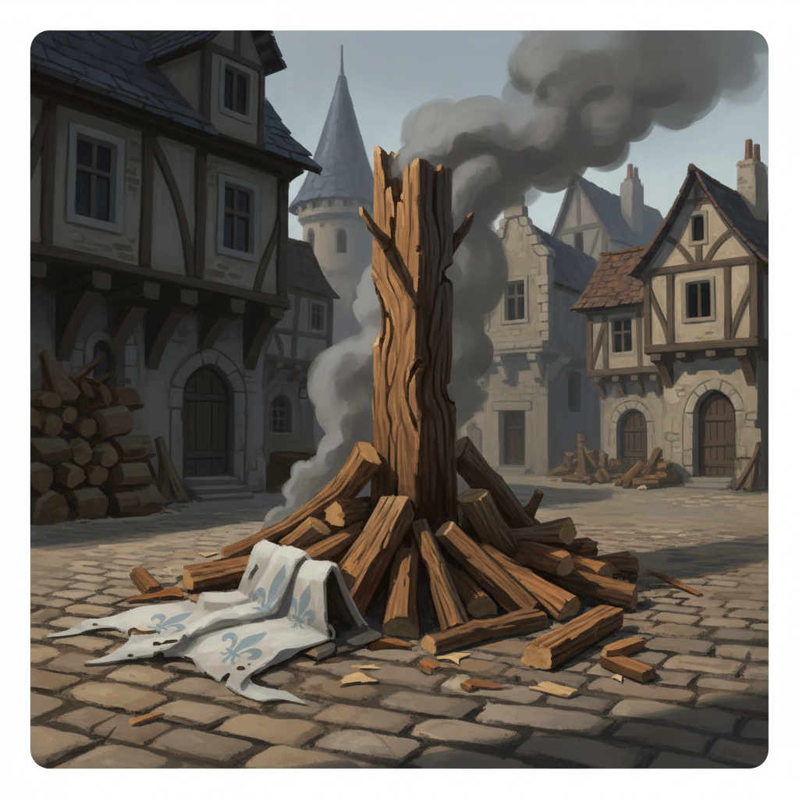
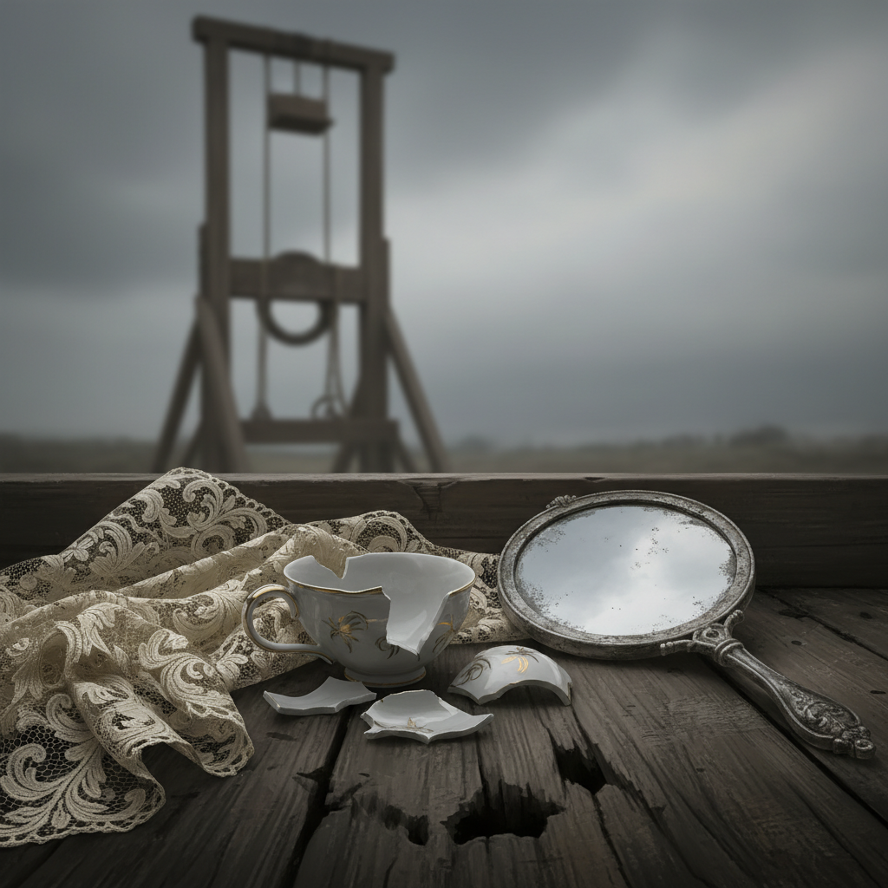
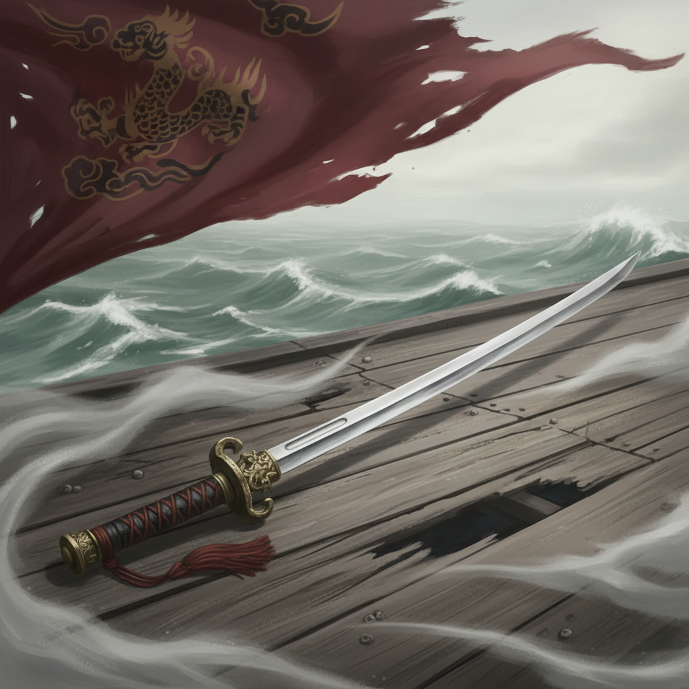
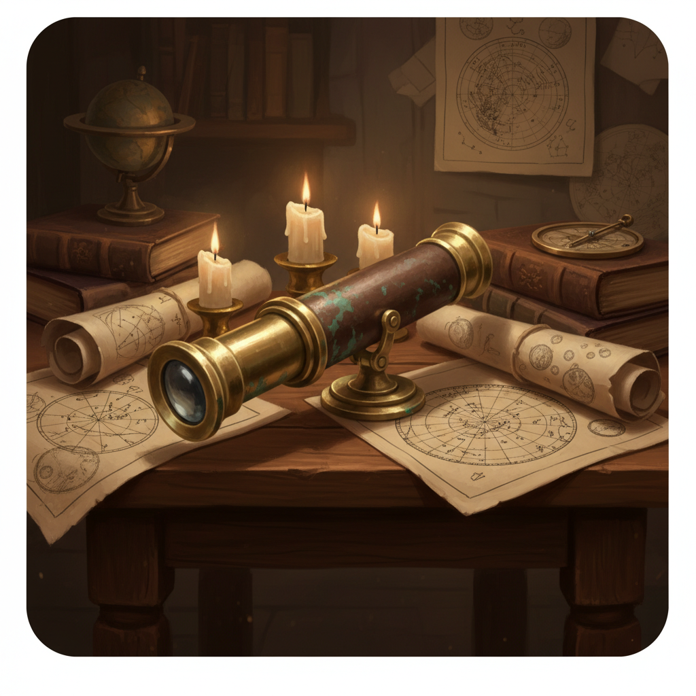
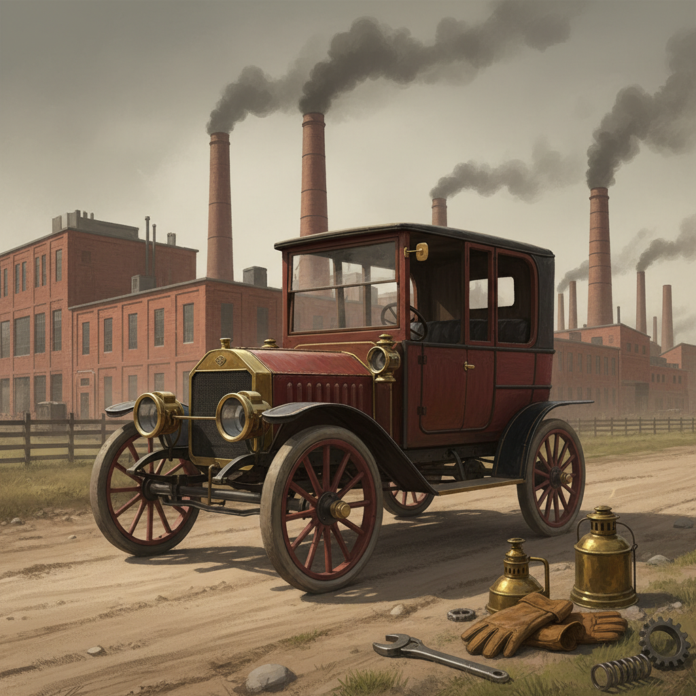
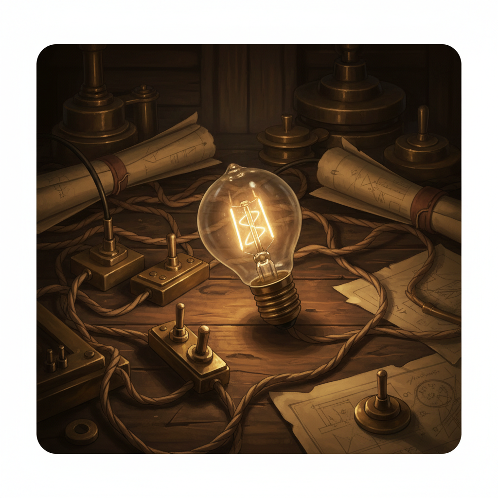
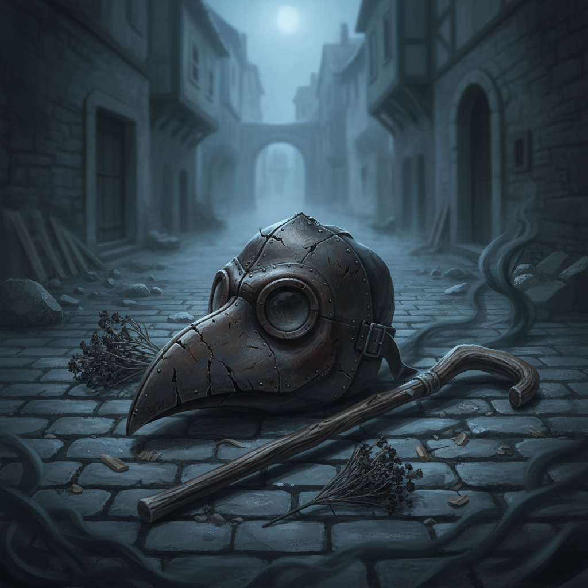
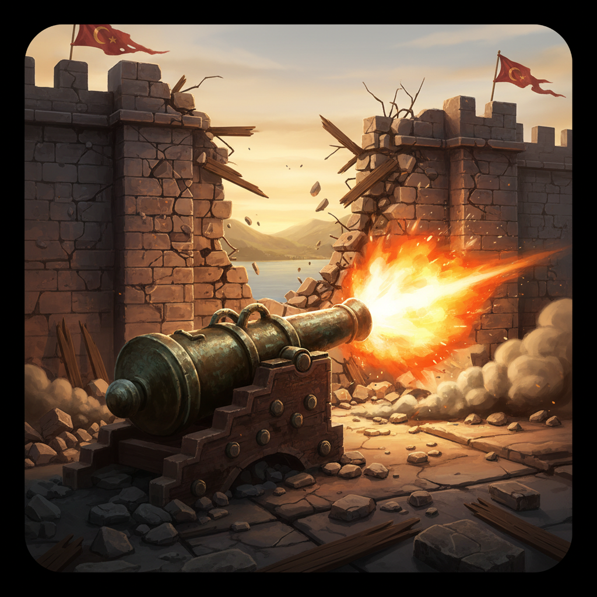
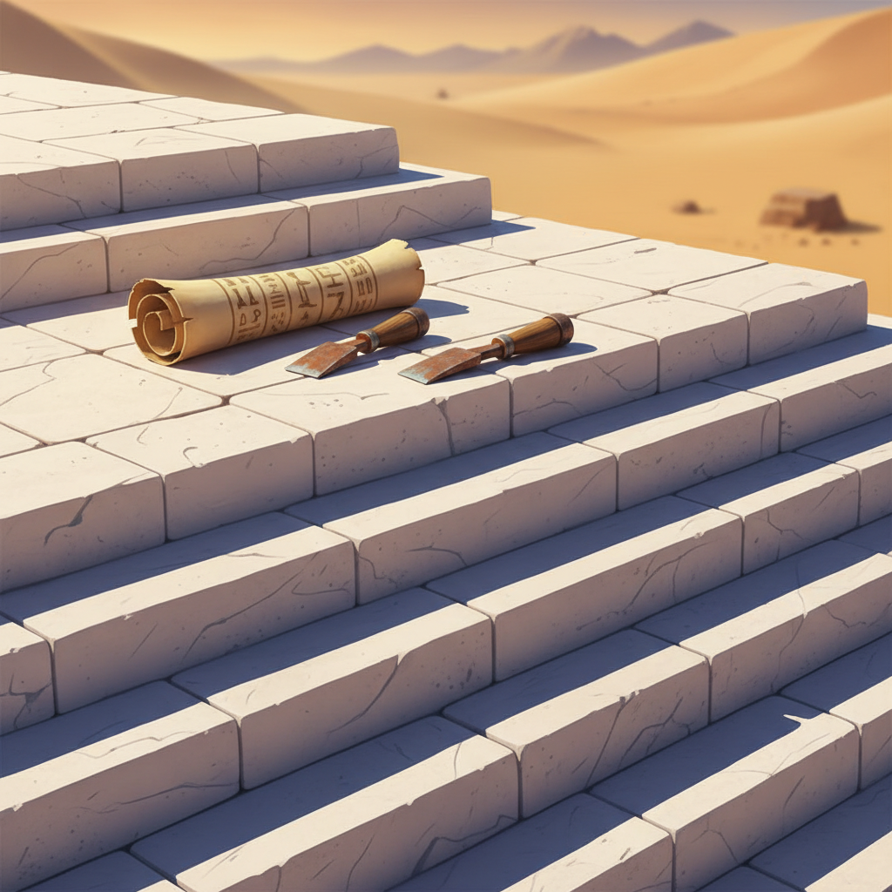

# Quiz Image Validation (Top 10 Pick)

## 잔 다르크

- **Korean Concept**: 바싹 마른 장작더미로 둘러싸인 거친 나무 말뚝과, 희미한 백합 문양이 남은 찢어진 흰 깃발이 나뒹구는 중세 유럽 돌바닥 광장의 풍경입니다. 웅장한 건축물을 배경으로 짙은 잿빛 연기가 피어오르는 가운데 극적인 명암이 드리워져 영화 같은 긴장감을 자아내는 고해상도 이미지입니다.
- **English Prompt**: 
```text
A weathered wooden stake in the center of a cobblestone square, surrounded by piles of dry firewood. A torn white banner with faint fleur-de-lis patterns lies on the ground nearby. Medieval European architecture in the background, thick grey smoke starting to rise, dramatic lighting, cinematic atmosphere, highly detailed, 8k resolution.. stylized historical clue card illustration, premium adult strategy game tone, semi-realistic digital painting, square composition, single clear focal subject, readable at small card size, restrained cinematic lighting, no readable text, no letters, no watermark, no UI elements. Avoid human, people, text, watermark, signature, full body, extreme macro.
```



## 마리 앙투아네트

- **Korean Concept**: 흙먼지 묻은 거친 나무 수레 바닥에 산산조각 난 우아한 도자기 찻잔과 화려한 로코코풍 실크 레이스가 나뒹구는 극사실적인 클로즈업 사진. 먹구름 낀 하늘을 비추는 심하게 빛바랜 은장 거울 너머로, 흐릿하게 보이는 거대한 나무 단두대의 윤곽이 서늘하고 비극적인 분위기를 자아냅니다.
- **English Prompt**: 
```text
A close-up of a shattered elegant porcelain teacup on a dirty wooden cart floor. Next to it lies a piece of luxurious Rococo-style silk lace and a heavily tarnished silver hand mirror reflecting a dark, overcast sky. Subtle hint of a massive wooden guillotine frame in the blurred background. Photorealistic, moody lighting, highly detailed.. stylized historical clue card illustration, premium adult strategy game tone, semi-realistic digital painting, square composition, single clear focal subject, readable at small card size, restrained cinematic lighting, no readable text, no letters, no watermark, no UI elements. Avoid human, people, text, watermark, signature, full body, extreme macro.
```



## 이순신

- **Korean Concept**: 짙은 해무와 거친 파도 속, 세월의 흔적이 느껴지는 낡은 나무 갑판 위에 동아시아 장군의 장검이 놓여 있는 영화 같은 장면입니다. 극적인 조명 아래 빛바랜 붉은 문양의 찢어진 군기가 배경에서 휘날리며, 거친 질감과 비장한 분위기를 생생하게 자아냅니다.
- **English Prompt**: 
```text
A highly detailed cinematic still of a traditional East Asian admiral's long sword resting on a worn wooden ship deck, surrounded by thick sea fog and turbulent ocean waves, a torn battle flag with faded red patterns waving in the background, realistic textures, 8k resolution, dramatic lighting.. stylized historical clue card illustration, premium adult strategy game tone, semi-realistic digital painting, square composition, single clear focal subject, readable at small card size, restrained cinematic lighting, no readable text, no letters, no watermark, no UI elements. Avoid human, people, text, watermark, signature, full body, character.
```



## 갈릴레오 갈릴레이

- **Korean Concept**: 은은한 촛불이 먼지 쌓인 17세기 유럽의 서재를 비추는 가운데, 묵직한 참나무 테이블 위에 놓인 고풍스러운 황동 망원경과 흩어진 천문도들을 담아낸 극사실적인 클로즈업 사진. 오래된 금속과 거친 나무의 질감, 그리고 영화 같은 신비로운 분위기가 생생하게 돋보입니다.
- **English Prompt**: 
```text
A hyper-realistic close-up of an antique brass telescope resting on a heavy oak table, scattered astronomical charts and sketches of the moon's surface nearby, soft candlelight illuminating the dusty room of a 17th-century European study, cinematic atmosphere, 8k resolution.. stylized historical clue card illustration, premium adult strategy game tone, semi-realistic digital painting, square composition, single clear focal subject, readable at small card size, restrained cinematic lighting, no readable text, no letters, no watermark, no UI elements. Avoid human, people, text, watermark, signature, full body, modern objects.
```



## 포드 모델 T

- **Korean Concept**: 흙먼지가 내려앉은 거친 비포장도로 위에 묵직한 검은색 강철 섀시와 스포크 휠을 장착한 각진 빈티지 자동차가 세워져 있습니다. 연기 나는 낡은 20세기 초 벽돌 공장을 배경으로 녹슨 금속 공구와 기름 램프가 흩어져 있는, 영화처럼 고풍스럽고 극사실적인 분위기의 사진입니다.
- **English Prompt**: 
```text
A vintage, boxy motor vehicle with spoked wheels and a black steel chassis resting on a dusty dirt road, a backdrop of an early 20th-century brick factory with smoke stacks, old oil lamps and mechanic tools scattered nearby, cinematic vintage aesthetic, ultra-detailed, photorealistic.. stylized historical clue card illustration, premium adult strategy game tone, semi-realistic digital painting, square composition, single clear focal subject, readable at small card size, restrained cinematic lighting, no readable text, no letters, no watermark, no UI elements. Avoid human, people, text, watermark, signature, full body, modern cars.
```



## 백열전구

- **Korean Concept**: 어질러진 전선과 황동 스위치, 빛바랜 수기 노트가 널브러진 고풍스러운 나무 책상 위에서 가느다란 탄소 필라멘트가 따뜻한 빛을 뿜어내는 섬세한 유리 전구. 극적인 명암 대비를 통해 나무의 거친 질감과 유리의 투명함, 빈티지한 무드를 생생하게 살린 극사실적 사진입니다.
- **English Prompt**: 
```text
A delicate glass bulb glowing with a warm, bright light from a thin carbon filament inside, resting on an antique wooden desk littered with messy electrical wires, brass switches, and old handwritten scientific notes, dramatic chiaroscuro lighting, highly detailed, photorealistic.. stylized historical clue card illustration, premium adult strategy game tone, semi-realistic digital painting, square composition, single clear focal subject, readable at small card size, restrained cinematic lighting, no readable text, no letters, no watermark, no UI elements. Avoid human, people, text, watermark, signature, full body, modern LED.
```



## 유럽 흑사병 창궐

- **Korean Concept**: 차갑고 축축한 중세 골목길 돌바닥에 버려진, 섬뜩한 가죽 질감의 긴 부리 역병 의사 가면과 거칠고 낡은 나무 지팡이. 바싹 마른 약초들이 흩어진 짙은 안개 속 극적인 명암이 어우러져 지독히 음산한 분위기를 자아내는 실사 이미지.
- **English Prompt**: 
```text
A terrifying leather plague doctor mask with a long beak left on cold, damp cobblestones, a worn wooden walking stick lying next to it, scattered dried herbs and dark mist in a medieval European alleyway, eerie and grim atmosphere, cinematic lighting, 8k resolution, photorealistic.. stylized historical clue card illustration, premium adult strategy game tone, semi-realistic digital painting, square composition, single clear focal subject, readable at small card size, restrained cinematic lighting, no readable text, no letters, no watermark, no UI elements. Avoid human, people, text, watermark, signature, full body, extreme macro.
```



## 콘스탄티노플 함락

- **Korean Concept**: 산산조각 난 거친 석조 잔해와 찢겨진 초승달 무늬의 붉은 깃발들 사이로, 거대한 고대 석벽을 향해 맹렬히 불을 뿜는 육중한 청동 대포의 극사실적인 풍경입니다. 멀리 황금뿔만(골든혼)이 아스라히 보이며, 영화 같은 극적인 조명과 디테일이 장엄한 전투의 분위기를 극대화하는 고해상도 장면입니다.
- **English Prompt**: 
```text
A massive bronze cannon firing towards ancient massive stone walls, broken masonry, a golden horn bay in the distance, torn red flags with crescents subtly placed among the debris, cinematic lighting, ultra-realistic, highly detailed, 8k resolution.. stylized historical clue card illustration, premium adult strategy game tone, semi-realistic digital painting, square composition, single clear focal subject, readable at small card size, restrained cinematic lighting, no readable text, no letters, no watermark, no UI elements. Avoid human, people, text, watermark, signature, full body.
```



## 베토벤

- **Korean Concept**: 깊은 마호가니 나무 질감이 돋보이는 빈티지 피아노 위에 거칠게 휘갈긴 잉크 자국이 가득한 두꺼운 악보와 빛바랜 황동 귀트럼펫, 깃털 펜이 어지럽게 놓인 사진입니다. 녹아내리는 촛불의 따스한 빛이 더해져 19세기 유럽의 고풍스럽고 시네마틱한 무드를 자아냅니다.
- **English Prompt**: 
```text
A highly detailed, atmospheric image of a cluttered vintage piano top. Thick, messy sheet music with aggressive, chaotic ink notes and crossed-out sections lies under the warm glow of a melting candle. A tarnished brass ear trumpet rests beside a feathered quill. Rich mahogany wood textures, 19th-century European aesthetic, cinematic lighting, 8k resolution.. stylized historical clue card illustration, premium adult strategy game tone, semi-realistic digital painting, square composition, single clear focal subject, readable at small card size, restrained cinematic lighting, no readable text, no letters, no watermark, no UI elements. Avoid human, people, text, watermark, signature, full body, extreme macro.
```


## 기자의 대피라미드

- **Korean Concept**: 작열하는 사막 태양 아래 계단식으로 쌓인 거대한 하얀 석회암 표면 위로, 빛바랜 파피루스 두루마리와 낡은 구리 끌이 놓여 있는 클로즈업 사진. 영화 같은 조명과 극사실적인 질감 묘사가 고대 이집트의 웅장하고 신비로운 분위기를 자아냅니다.
- **English Prompt**: 
```text
A close view of massive, precisely cut white limestone blocks stacked in a stepped formation under a blazing desert sun, with an ancient faded papyrus scroll and worn copper chisels resting on the stone surface, hyper-detailed, cinematic lighting, ancient Egyptian aesthetic.. stylized historical clue card illustration, premium adult strategy game tone, semi-realistic digital painting, square composition, single clear focal subject, readable at small card size, restrained cinematic lighting, no readable text, no letters, no watermark, no UI elements. Avoid human, people, text, watermark, signature, full body, modern tools.
```



