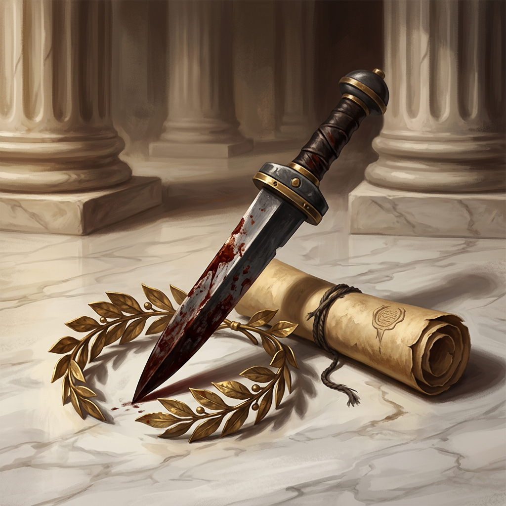
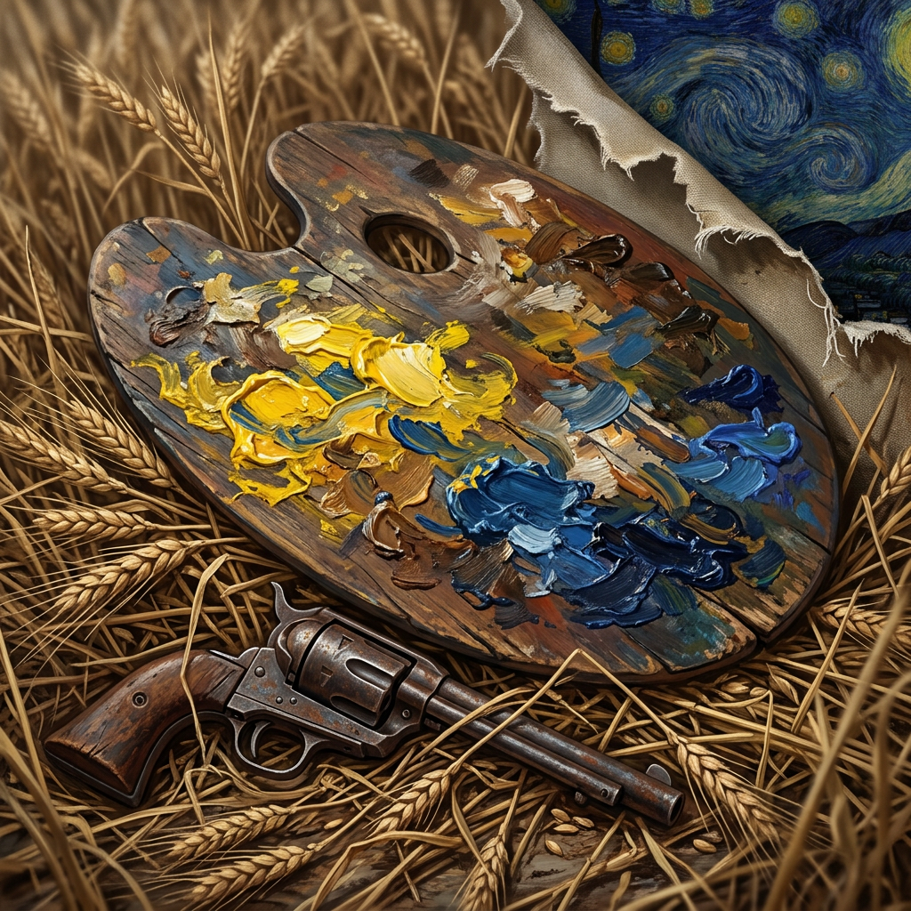
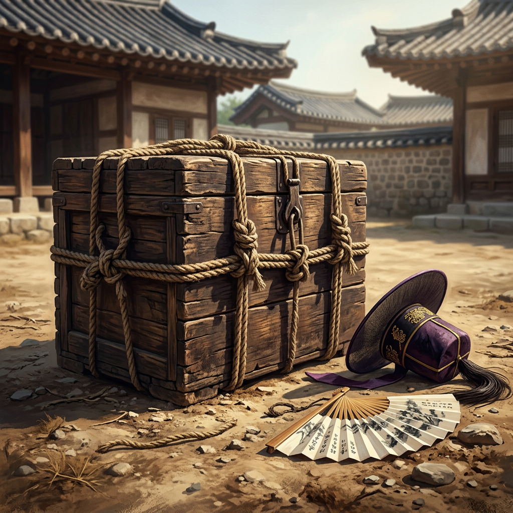
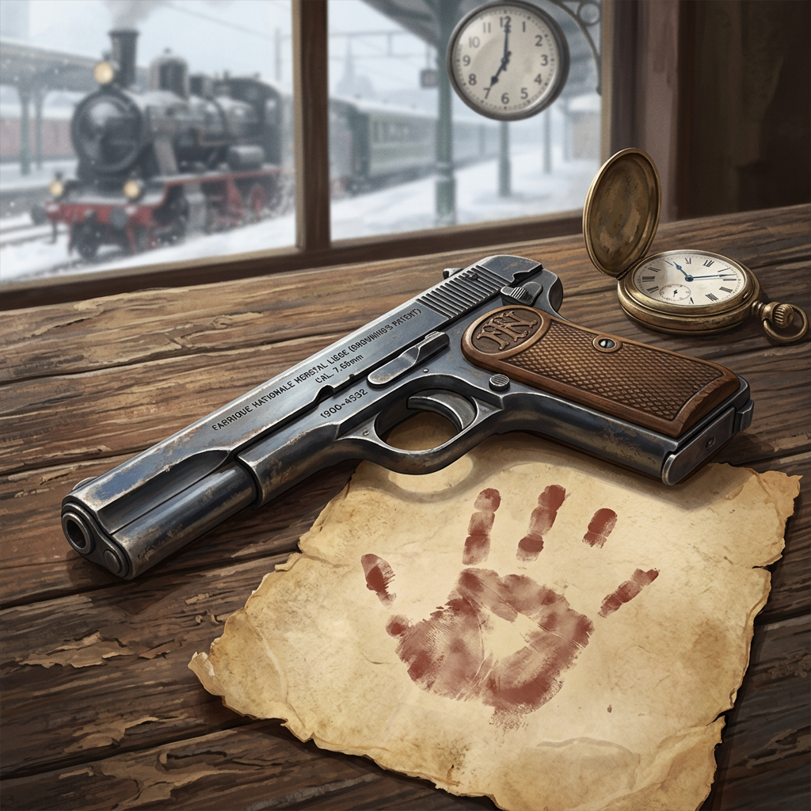
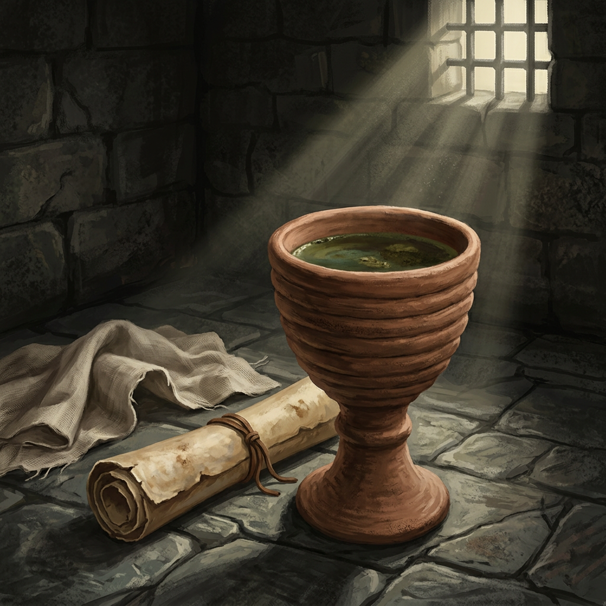
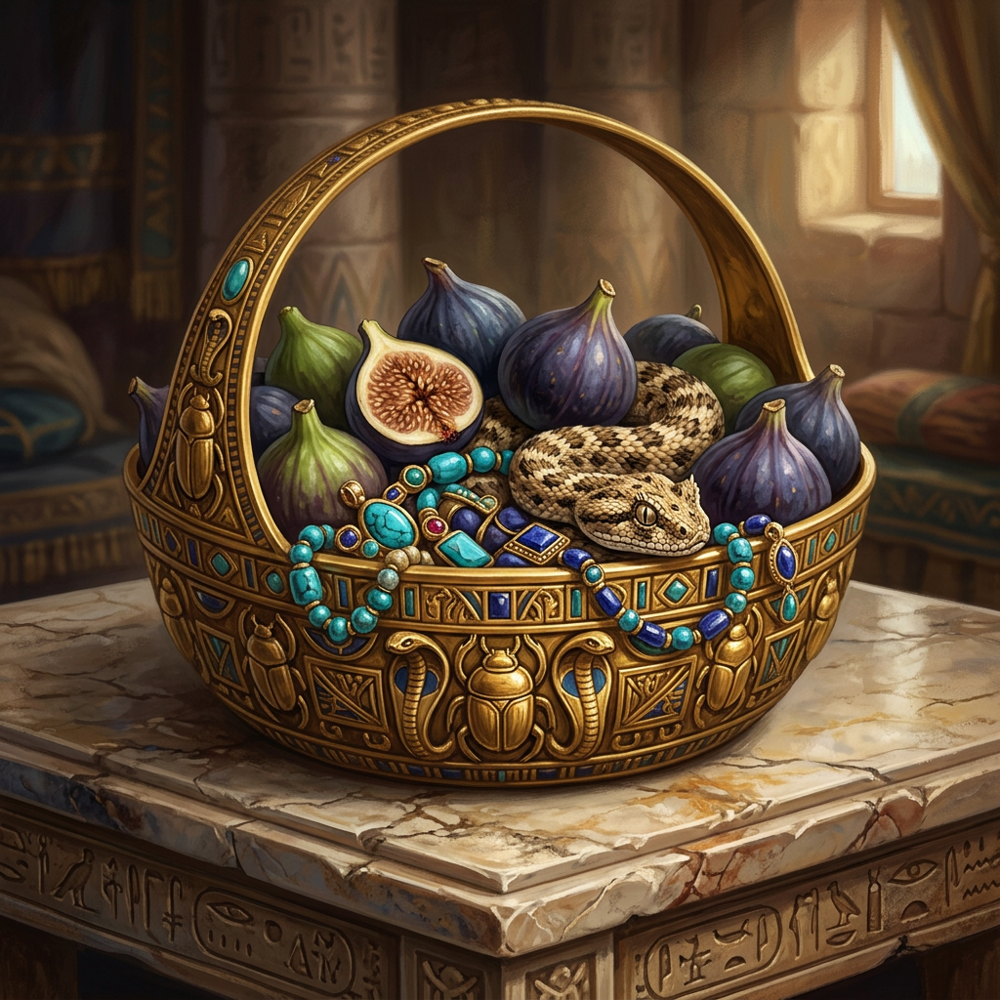
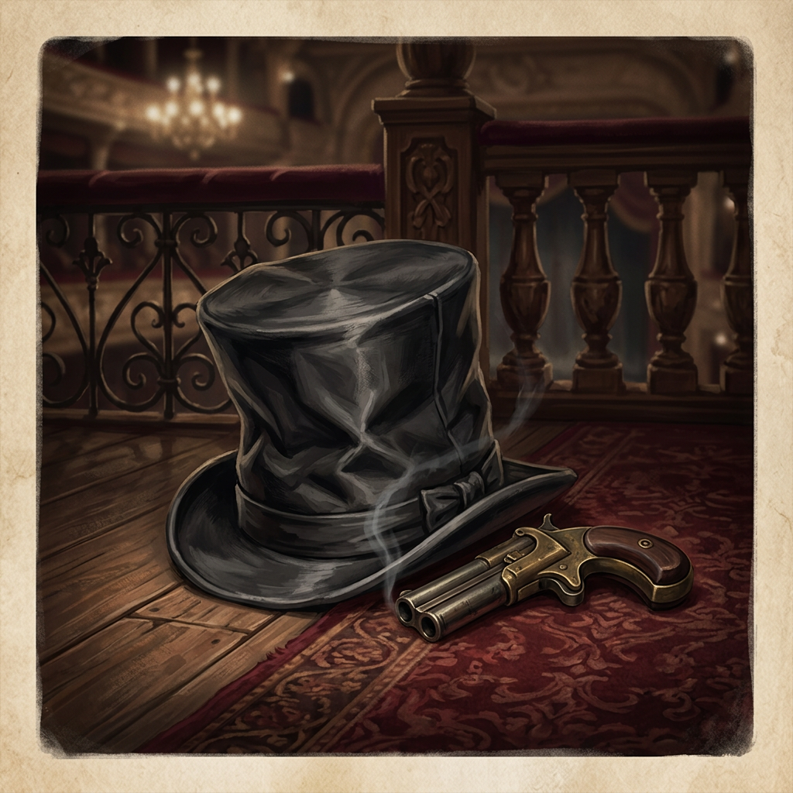
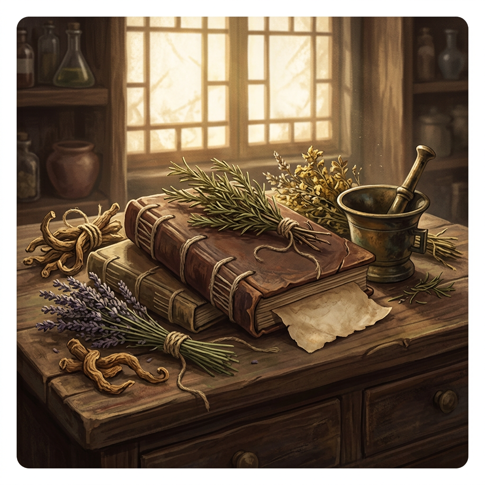
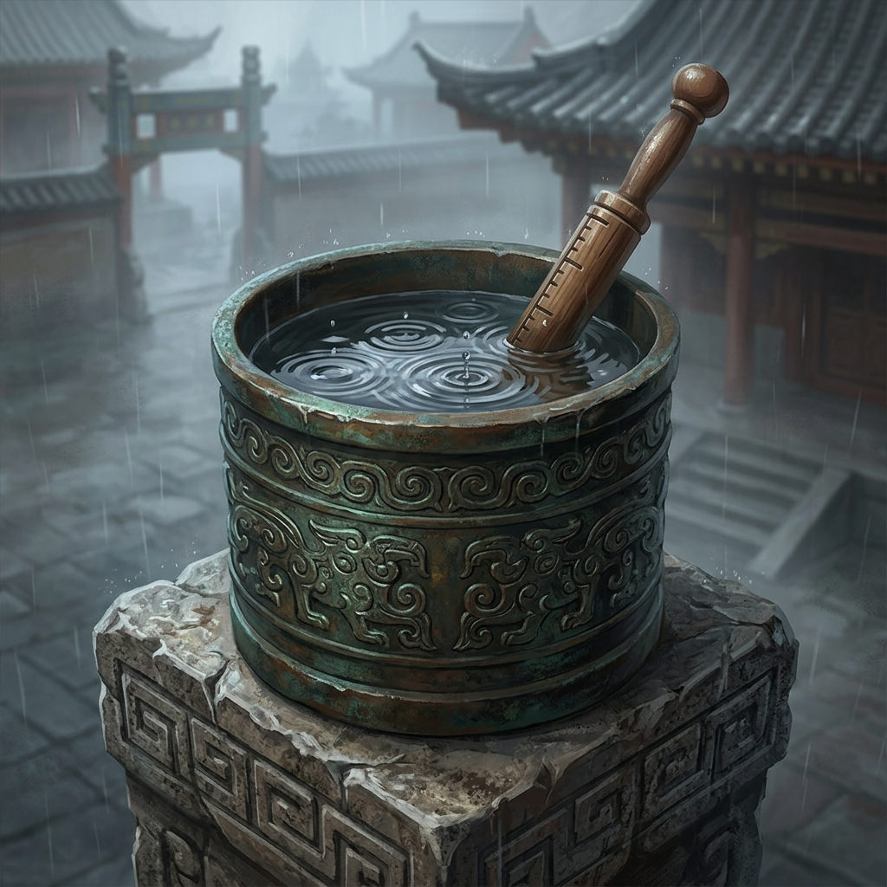
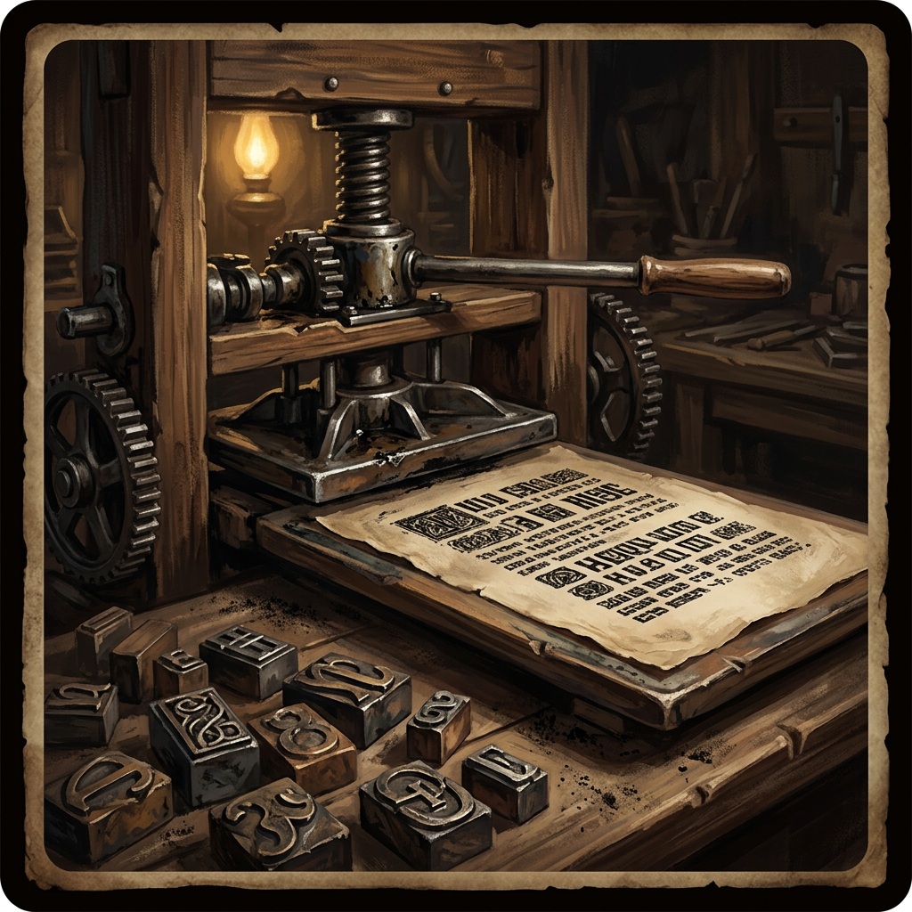

# Quiz Image Validation V2 (Gemini 3.1 Flash Image)

## 율리우스 카이사르

- **Korean Concept**: 새하얗고 매끄러운 대리석 바닥 위에 피 묻은 투박한 로마의 철제 단검과 낡은 양피지 두루마리, 바닥에 떨어진 황금빛 월계관이 놓인 극사실적 이미지입니다. 배경에는 고대 원로원의 장엄한 기둥들이 영화 같은 조명 아래 흐릿하게 펼쳐지며 웅장하고 극적인 분위기를 자아냅니다.
- **English Prompt**: 
```text
A bloody Roman iron dagger lying on a pristine white marble floor. Next to the dagger is a rolled-up ancient parchment scroll and a fallen golden laurel wreath. Grand marble columns of an ancient senate building in the soft, dramatic background. Cinematic lighting, highly detailed, historical realism.. stylized historical clue card illustration, premium adult strategy game tone, semi-realistic digital painting, square composition, single clear focal subject, readable at small card size, restrained cinematic lighting, no readable text, no letters, no watermark, no UI elements. Avoid human, people, text, watermark, signature, full body, extreme macro.
```



## 빈센트 반 고흐

- **Korean Concept**: 강렬한 노란색과 짙은 푸른색 유화 물감이 두껍게 얹힌 낡은 나무 팔레트와 녹슨 19세기 리볼버가 바싹 마른 밀짚 사이에 반쯤 숨겨져 있는 고해상도 사진. 그 곁의 찢어진 캔버스 가장자리에 소용돌이치는 별밤이 희미하게 비치며, 거칠고도 생생한 질감과 사실적인 빛을 극적으로 담아냈습니다.
- **English Prompt**: 
```text
A worn wooden painter's palette covered in thick, vibrant yellow and deep blue oil paints, resting on dry wheat stalks. An old, rusty 19th-century revolver lies partially hidden in the wheat. A swirling, starry night sky can be subtly seen painted on a torn canvas edge nearby. Masterpiece, realistic lighting, 8k resolution.. stylized historical clue card illustration, premium adult strategy game tone, semi-realistic digital painting, square composition, single clear focal subject, readable at small card size, restrained cinematic lighting, no readable text, no letters, no watermark, no UI elements. Avoid human, people, text, watermark, signature, full body, extreme macro.
```



## 사도세자

- **Korean Concept**: 강렬한 여름 햇빛으로 바싹 마른 흙바닥 위, 굵고 거친 삼줄로 꽁꽁 묶인 묵직한 나무 뒤주를 담아낸 실사풍 사진입니다. 짙은 그림자 속 덩그러니 나뒹구는 비단 관모와 합죽선, 흐릿한 궁궐 기와지붕 배경이 어우러져 극적이고 묵직한 분위기를 자아냅니다.
- **English Prompt**: 
```text
A large, heavy traditional Korean wooden rice chest tightly bound with thick hemp ropes, sitting on a sunbaked dirt courtyard. Next to the chest is a fallen royal silk hat and a scattered folding fan. Traditional Korean palace architecture with tiled roofs in the slightly blurred background. Intense summer sunlight, dramatic shadows, photorealistic, historical accuracy.. stylized historical clue card illustration, premium adult strategy game tone, semi-realistic digital painting, square composition, single clear focal subject, readable at small card size, restrained cinematic lighting, no readable text, no letters, no watermark, no UI elements. Avoid human, people, text, watermark, signature, full body, extreme macro.
```



## 안중근

- **Korean Concept**: 세월의 흔적이 깊게 팬 거친 나무 테이블 위에 놓인 낡은 FN 브라우닝 M1900 권총과, 약지 끝이 잘린 붉은 손자국이 희미하게 번진 누렇게 바랜 종이를 담은 극사실적인 사진입니다. 눈 내리는 차가운 겨울 아침의 기차역과 회중시계가 아웃포커싱 된 배경 위로 시네마틱한 조명이 떨어지며 서늘하고 비장한 분위기를 자아냅니다.
- **English Prompt**: 
```text
A highly detailed, realistic image of an antique FN Browning M1900 pistol resting on a worn wooden table. Next to it is a piece of aged, yellowish paper faintly marked with a red handprint missing the tip of the ring finger. In the background, out of focus, a snowy train station platform and a pocket watch indicating a cold winter morning. Cinematic lighting, 8k resolution, photorealistic.. stylized historical clue card illustration, premium adult strategy game tone, semi-realistic digital painting, square composition, single clear focal subject, readable at small card size, restrained cinematic lighting, no readable text, no letters, no watermark, no UI elements. Avoid human, people, text, watermark, signature, full body, extreme macro.
```



## 소크라테스

- **Korean Concept**: 고대 그리스 감옥의 차갑고 거친 돌바닥 위에 짙은 녹색 액체가 담긴 투박한 찰흙 성배와 낡은 두루마리, 늘어진 린넨 천이 놓여 있는 극사실적 이미지입니다. 쇠창살 틈으로 스며든 한 줄기 햇빛이 길게 그림자를 드리우며 서늘하고 적막한 분위기를 자아냅니다.
- **English Prompt**: 
```text
A hyper-realistic image of a rustic clay chalice filled with a dark greenish liquid, sitting on a rough, cold stone floor of an ancient Greek prison. Beside the cup lies a worn scroll and a simple draped linen cloth. Dimly lit by a single shaft of sunlight coming from a small grated window, casting long shadows. 8k resolution, highly detailed, photorealistic.. stylized historical clue card illustration, premium adult strategy game tone, semi-realistic digital painting, square composition, single clear focal subject, readable at small card size, restrained cinematic lighting, no readable text, no letters, no watermark, no UI elements. Avoid human, people, text, watermark, signature, full body, extreme macro.
```



## 클레오파트라

- **Korean Concept**: 따뜻하고 풍부한 조명 아래, 호화로운 고대 이집트 대리석 테이블 위 잘 익은 무화과가 담긴 정교한 금빛 바구니의 생생한 모습입니다. 달콤한 과육과 흩어진 터키석, 청금석 보석들 사이로 매끄러운 비늘을 번뜩이는 치명적인 사막 독사가 은밀하게 똬리를 틀고 있는 긴장감 넘치는 장면입니다.
- **English Prompt**: 
```text
A photorealistic, highly detailed scene of an ornate golden basket filled with ripe figs resting on an opulent ancient Egyptian marble table. Coiled hidden among the figs and scattered turquoise and lapis lazuli jewelry is a small, dangerous desert viper with sleek scales. Rich, warm Mediterranean lighting, intricate gold details, 8k resolution, cinematic composition.. stylized historical clue card illustration, premium adult strategy game tone, semi-realistic digital painting, square composition, single clear focal subject, readable at small card size, restrained cinematic lighting, no readable text, no letters, no watermark, no UI elements. Avoid human, people, text, watermark, signature, full body, extreme macro.
```



## 에이브러햄 링컨

- **Korean Concept**: 풍성한 붉은색 카펫이 깔린 나무 바닥 위, 구겨진 검은 실크 탑햇과 옅은 연기를 피어올리는 고풍스러운 소형 권총이 놓인 극사실적인 사진입니다. 흐릿한 19세기 극장 발코니를 배경으로, 묵직하고 극적인 조명이 실크의 매끄러운 윤기와 차가운 금속의 질감을 생생하게 살려냅니다.
- **English Prompt**: 
```text
A highly detailed, realistic image of a crumpled, tall black silk top hat resting on a wooden floor covered with a rich red carpet. Next to the hat lies a small, antique Derringer pistol emitting a very faint trail of smoke. In the background, out of focus, the ornate railing of a 19th-century theater balcony. Dramatic, moody lighting, 8k resolution, photorealistic.. stylized historical clue card illustration, premium adult strategy game tone, semi-realistic digital painting, square composition, single clear focal subject, readable at small card size, restrained cinematic lighting, no readable text, no letters, no watermark, no UI elements. Avoid human, people, text, watermark, signature, full body, extreme macro.
```



## 허준

- **Korean Concept**: 어두운 목재 약장 위에 굵은 실로 엮은 낡은 의서와 바싹 말린 약초, 거친 청동 절구가 놓여 있는 사실적인 정물 사진. 전통 창호지를 투과한 따스한 햇살이 오래된 종이와 약재의 질감을 섬세하고 고풍스럽게 비춥니다.
- **English Prompt**: 
```text
A realistic still life of ancient medical books bound with thick thread lying on a dark wooden apothecary cabinet, dried medicinal herbs, roots, and a small bronze mortar placed around the parchment, soft warm sunlight filtering through a traditional paper window, highly detailed, 8k resolution.. stylized historical clue card illustration, premium adult strategy game tone, semi-realistic digital painting, square composition, single clear focal subject, readable at small card size, restrained cinematic lighting, no readable text, no letters, no watermark, no UI elements. Avoid human, people, text, watermark, signature, full body, modern medicine.
```



## 측우기

- **Korean Concept**: 안개 낀 동양의 궁궐 뜰을 배경으로, 거친 화강암 받침대 위 낡은 원통형 청동 용기에 빗물이 고여 잔물결이 이는 극사실적인 시네마틱 사진. 그 안에 꽂힌 오래된 전통 나무 자의 질감과 비 오는 날의 축축하고 고즈넉한 무드가 생생하게 돋보입니다.
- **English Prompt**: 
```text
A highly detailed cinematic shot of an ancient cylindrical bronze vessel placed on a carved granite pedestal, a traditional wooden measuring stick resting inside, rain drops falling and rippling on the water surface inside the cylinder, background hints of a traditional East Asian palace courtyard covered in mist, 8k resolution, photorealistic.. stylized historical clue card illustration, premium adult strategy game tone, semi-realistic digital painting, square composition, single clear focal subject, readable at small card size, restrained cinematic lighting, no readable text, no letters, no watermark, no UI elements. Avoid human, people, text, watermark, signature, full body, modern buildings.
```



## 구텐베르크 활판 인쇄기

- **Korean Concept**: 15세기 공방의 따스한 조명 아래, 꾸덕한 검은 잉크가 엉겨 붙은 차가운 금속 활자와 묵직한 고목재 인쇄기의 질감이 생생하게 살아있는 극사실적 클로즈업 사진. 먼지 앉은 작업대에 흩어진 활자 조각들과 갓 찍어낸 라틴어 성경 페이지가 어우러져 짙은 고풍스러움을 자아냅니다.
- **English Prompt**: 
```text
A hyper-realistic close-up of a massive antique wooden printing press mechanism, rows of metallic movable type covered in thick black ink, a freshly printed page of a Latin bible resting on the pressing board, scattered metal letter blocks on a dusty workbench, warm atmospheric lighting in a 15th-century workshop, 8k resolution.. stylized historical clue card illustration, premium adult strategy game tone, semi-realistic digital painting, square composition, single clear focal subject, readable at small card size, restrained cinematic lighting, no readable text, no letters, no watermark, no UI elements. Avoid human, people, text, watermark, signature, full body, digital, modern machinery.
```



