# Quiz Image Validation V2 (Gemini 3.1 Flash Image - 512px)

Generated 29 items, 1 failures.

## 에니그마 (Global Index: 15)

- **Korean Concept**: 빛바랜 군사 지도와 나침반이 흩어진 낡은 나무 책상 위, 복잡한 배선과 빛나는 로터를 품은 타자기 형태의 빈티지 암호 기계가 놓여 있습니다. 은은한 황동 램프 불빛이 거친 나무와 금속의 질감을 섬세하게 비추며, 깊고 묵직한 분위기를 자아내는 극사실적인 이미지입니다.
- **English Prompt**: 
```text
A vintage typewriter-like cipher machine with glowing rotors and intricate wiring sitting on an old wooden desk, scattered faded military maps and a compass nearby, a dim glowing brass lamp illuminating the scene, moody lighting, highly detailed, 8k resolution, photorealistic.. stylized historical clue card illustration, premium adult strategy game tone, semi-realistic digital painting, square composition, single clear focal subject, readable at small card size, restrained cinematic lighting, no readable text, no letters, no watermark, no UI elements. Avoid human, people, text, watermark, signature, full body, letters on keys.
```

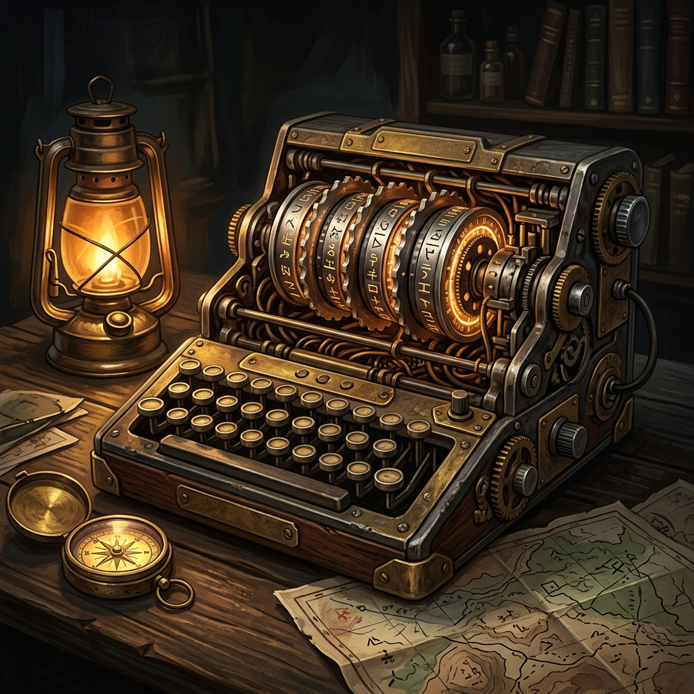

## 스푸트니크 1호 (Global Index: 16)

- **Korean Concept**: 빛바랜 키릴 문자 청사진과 낡은 계산자 위에 놓인, 4개의 긴 안테나가 뒤로 뻗은 매끄러운 고광택 금속 구체. 짙고 극적인 그림자가 드리워져 냉전 시대 연구실의 서늘한 분위기를 정교하게 담아낸 초고화질 사진.
- **English Prompt**: 
```text
A highly polished metallic sphere with four long swept-back antennas resting on top of faded Cyrillic blueprints and vintage slide rules, cold war era laboratory setting, dramatic cinematic shadows, sharp focus, 8k resolution, highly detailed.. stylized historical clue card illustration, premium adult strategy game tone, semi-realistic digital painting, square composition, single clear focal subject, readable at small card size, restrained cinematic lighting, no readable text, no letters, no watermark, no UI elements. Avoid human, people, text, watermark, signature, full body, letters, words.
```

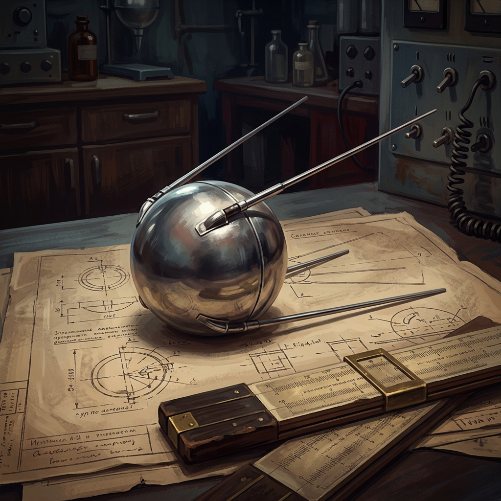

## 팔만대장경 (Global Index: 17)

- **Korean Concept**: 창살 틈으로 스며든 부드러운 햇살과 옅은 안개가 감도는 고즈넉한 옛 동양풍 전각 내부, 나무 선반에 수천 개의 정교한 목판이 가지런히 쌓여 있는 풍경. 오래된 나무의 섬세한 질감과 깊이 있는 분위기를 극사실적으로 생생하게 묘사한 8K 고해상도 이미지입니다.
- **English Prompt**: 
```text
Thousands of intricately carved wooden printing blocks stacked neatly on wooden shelves in an ancient, well-ventilated traditional East Asian pavilion, soft sunlight streaming through slatted windows, a subtle mist in the air, hyper-realistic, 8k, highly detailed wood texture.. stylized historical clue card illustration, premium adult strategy game tone, semi-realistic digital painting, square composition, single clear focal subject, readable at small card size, restrained cinematic lighting, no readable text, no letters, no watermark, no UI elements. Avoid human, people, text, watermark, signature, full body, modern objects.
```

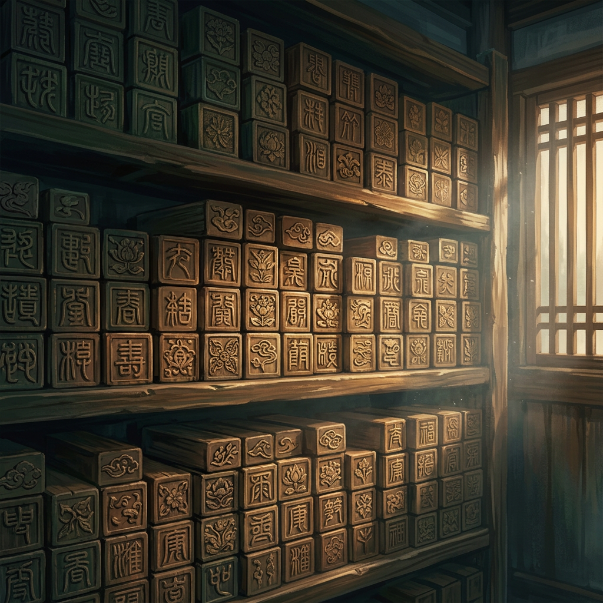

## 청자 상감운학문 매병 (Global Index: 18)

- **Korean Concept**: 고풍스러운 짙은 원목 테이블 위에 섬세한 운학 상감 무늬가 새겨진 우아한 곡선의 옥빛 도자기가 놓여 있는 극사실적인 사진. 부드러운 자연광이 도자기의 매끄러운 광택과 곁에 늘어진 낡고 빛바랜 비단 천의 질감을 은은하게 비추며 고즈넉한 분위기를 자아냅니다.
- **English Prompt**: 
```text
A sensuously curved ceramic vase with a jade-green glaze, adorned with delicate inlaid patterns of cranes flying among clouds, placed on an antique dark wooden table, soft natural light highlighting its glossy surface, a piece of ancient faded silk cloth draped nearby, 8k, photorealistic.. stylized historical clue card illustration, premium adult strategy game tone, semi-realistic digital painting, square composition, single clear focal subject, readable at small card size, restrained cinematic lighting, no readable text, no letters, no watermark, no UI elements. Avoid human, people, text, watermark, signature, full body, modern furniture.
```

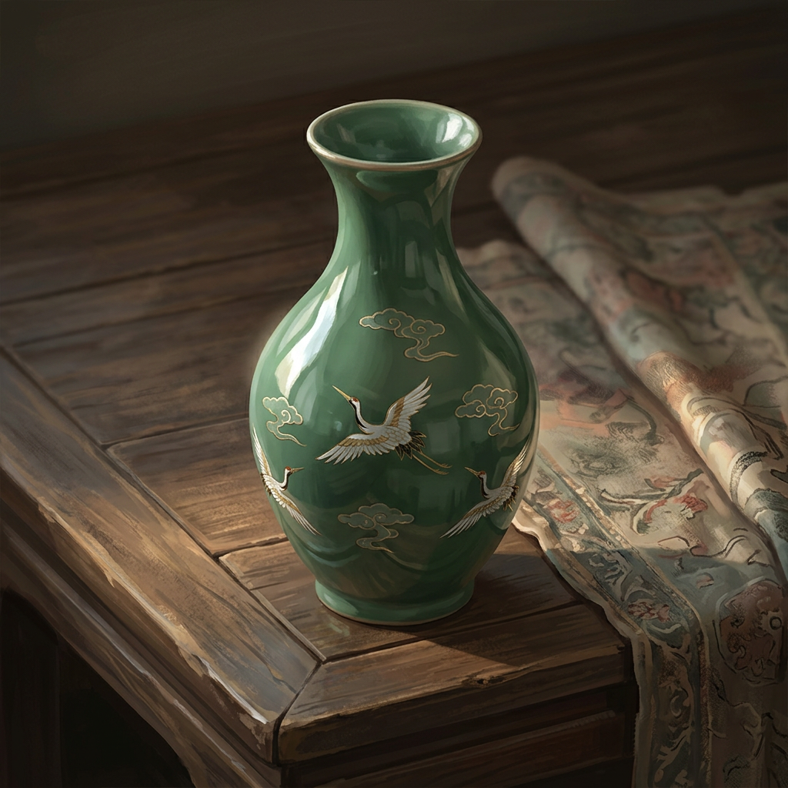

## 모나리자 (Global Index: 19)

- **Korean Concept**: 웅장한 미술관의 짙은 진홍색 벽에 걸린 화려한 빈 금빛 액자와 빛바랜 벨벳 로프의 질감이 돋보이는 초고화질 사진입니다. 걸작이 사라진 자리에 덩그러니 남은 4개의 갈고리가 은은한 조명을 받으며 극적이고 미스터리한 분위기를 자아냅니다.
- **English Prompt**: 
```text
An ornate, empty golden picture frame hanging on a rich crimson wall in a grand museum gallery, four small hooks visible where a masterpiece once rested, faded velvet ropes in the foreground, soft museum spotlight, dramatic and mysterious atmosphere, ultra-detailed, 8k.. stylized historical clue card illustration, premium adult strategy game tone, semi-realistic digital painting, square composition, single clear focal subject, readable at small card size, restrained cinematic lighting, no readable text, no letters, no watermark, no UI elements. Avoid human, people, text, watermark, signature, full body, painting inside the frame.
```

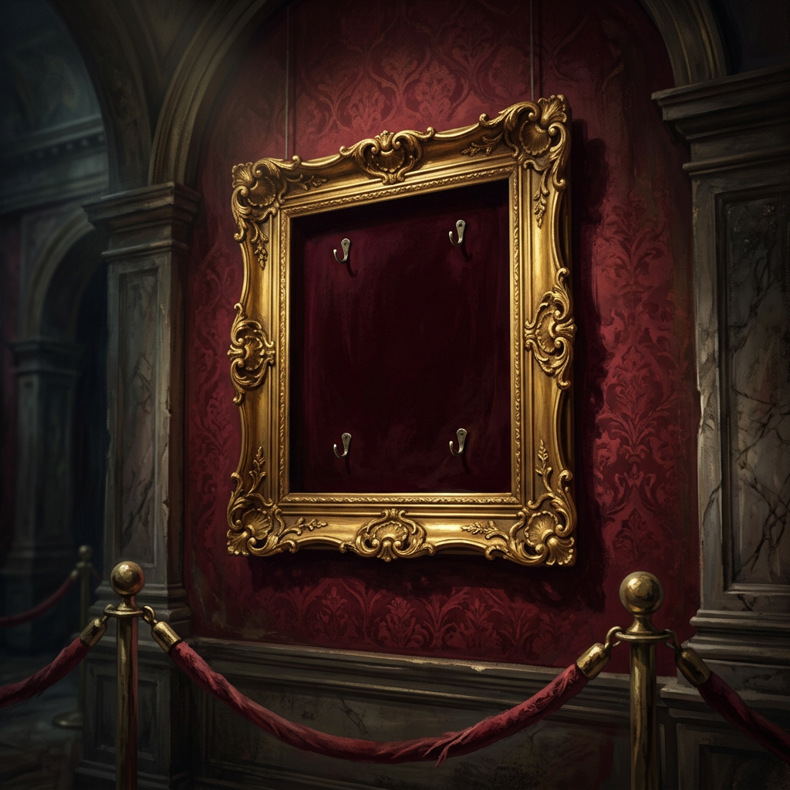

## 기요틴 (Global Index: 20)

- **Korean Concept**: 낡고 거친 밧줄과 톱니바퀴가 얽힌 두꺼운 나무 기둥 사이에 묵직한 사선형 강철 칼날이 서늘하게 매달려 있습니다. 자갈 광장 너머로 찢겨진 붉은 혁명기의 흔적이 희미하게 감도는 극사실적인 시네마틱 사진.
- **English Prompt**: 
```text
A heavy, angled steel blade suspended between two thick wooden pillars, weathered ropes and gears attached, set against a cobblestone square with faint remnants of a torn red revolution flag in the background, cinematic lighting, ultra-detailed, photorealistic.. stylized historical clue card illustration, premium adult strategy game tone, semi-realistic digital painting, square composition, single clear focal subject, readable at small card size, restrained cinematic lighting, no readable text, no letters, no watermark, no UI elements. Avoid human, people, text, watermark, signature, full body.
```

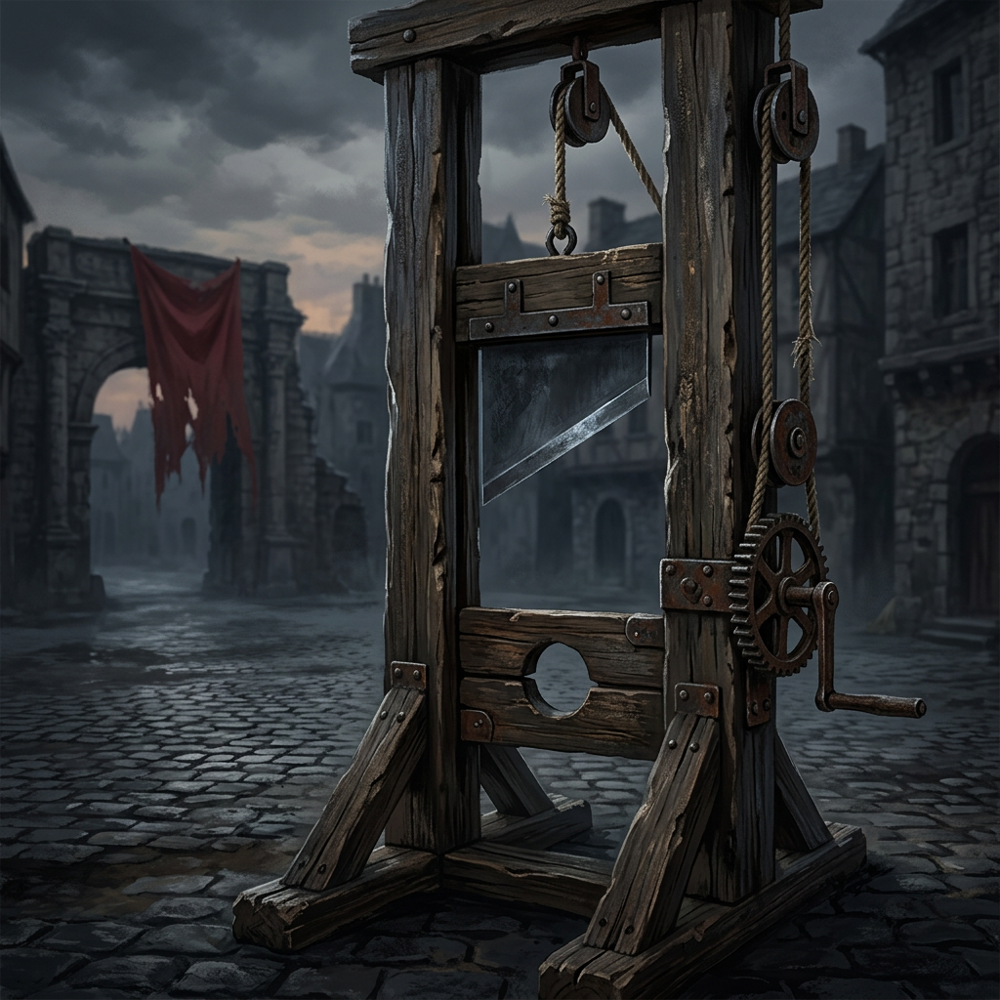

## 로제타 스톤 (Global Index: 21)

- **Korean Concept**: 황금빛 사막 모래에 반쯤 파묻힌 거칠고 어두운 화강섬록암 석판에 고대의 신비로운 기호와 문자들이 세 개의 단으로 빼곡히 새겨진 모습. 주변에 흩어진 낡은 황동 컴퍼스와 바랜 양피지 지도가 극적인 조명 아래 생생하고 사실적인 질감으로 묘사된 이미지입니다.
- **English Prompt**: 
```text
A massive, dark granodiorite slab partially buried in golden desert sand, closely inscribed with three distinct layers of ancient mysterious symbols and scripts, surrounded by old brass drafting compasses and weathered parchment maps, hyper-realistic, dramatic lighting, 8k resolution.. stylized historical clue card illustration, premium adult strategy game tone, semi-realistic digital painting, square composition, single clear focal subject, readable at small card size, restrained cinematic lighting, no readable text, no letters, no watermark, no UI elements. Avoid human, people, English text, watermark, signature, full body, modern objects.
```

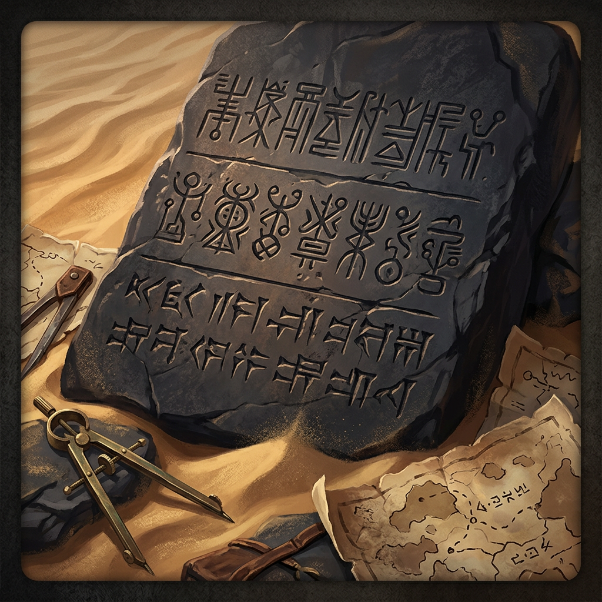

## 포드 모델 T (Global Index: 22)

- **Korean Concept**: 흙먼지가 내려앉은 거친 비포장도로 위에 묵직한 검은색 강철 섀시와 스포크 휠을 장착한 각진 빈티지 자동차가 세워져 있습니다. 연기 나는 낡은 20세기 초 벽돌 공장을 배경으로 녹슨 금속 공구와 기름 램프가 흩어져 있는, 영화처럼 고풍스럽고 극사실적인 분위기의 사진입니다.
- **English Prompt**: 
```text
A vintage, boxy motor vehicle with spoked wheels and a black steel chassis resting on a dusty dirt road, a backdrop of an early 20th-century brick factory with smoke stacks, old oil lamps and mechanic tools scattered nearby, cinematic vintage aesthetic, ultra-detailed, photorealistic.. stylized historical clue card illustration, premium adult strategy game tone, semi-realistic digital painting, square composition, single clear focal subject, readable at small card size, restrained cinematic lighting, no readable text, no letters, no watermark, no UI elements. Avoid human, people, text, watermark, signature, full body, modern cars.
```

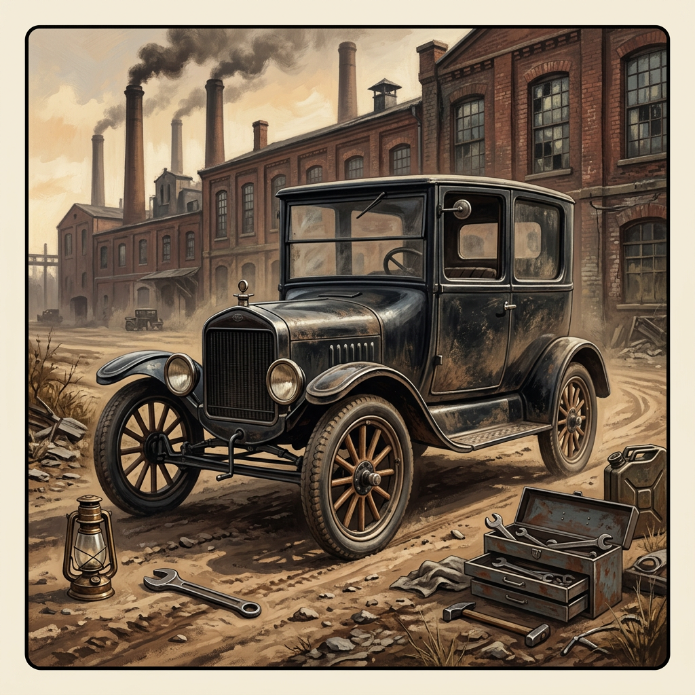

## 보스턴 차 사건 (Global Index: 28)

- **Korean Concept**: 어두운 밤 항구의 일렁이는 물결 위로 부서진 거친 나무 상자와 쏟아진 마른 찻잎들이 뒤섞여 떠 있는 모습. 은은한 랜턴 빛이 감도는 18세기 영국 상선을 배경으로, 역사적이면서도 반항적인 분위기를 섬세한 시네마틱 조명으로 담아낸 장면.
- **English Prompt**: 
```text
Broken wooden crates floating in a dark harbor at night, dried tea leaves spilling out and mixing with the rippling water, an 18th-century British merchant ship softly illuminated by lantern light in the background, rebellious and historic atmosphere, highly detailed, cinematic lighting.. stylized historical clue card illustration, premium adult strategy game tone, semi-realistic digital painting, square composition, single clear focal subject, readable at small card size, restrained cinematic lighting, no readable text, no letters, no watermark, no UI elements. Avoid human, people, text, watermark, signature, full body.
```

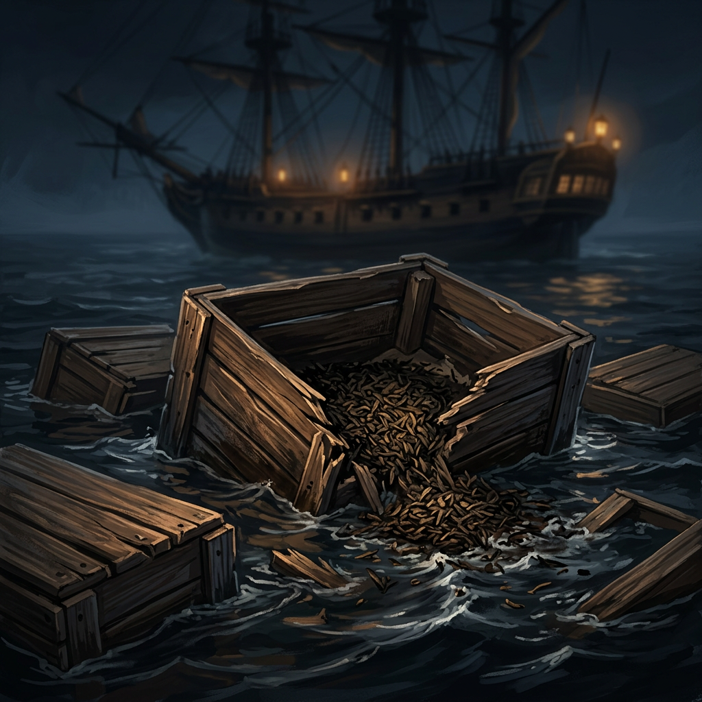

## 아폴로 11호 달 착륙 (Global Index: 29)

- **Korean Concept**: 고운 잿빛 먼지에 깊게 파인 선명한 부츠 자국과, 머나먼 푸른 행성을 비추는 헬멧의 매끄러운 금빛 바이저가 바닥에 놓인 극사실적 사진입니다. 극명한 명암 대비가 우주의 완벽한 정적과 고요한 분위기를 시각적으로 극대화합니다.
- **English Prompt**: 
```text
A deep, distinct boot print stamped into fine grey dust, a highly reflective golden visor of a space helmet partially visible on the ground reflecting a distant blue planet, stark contrast lighting, absolute silence, hyper-realistic, 8k.. stylized historical clue card illustration, premium adult strategy game tone, semi-realistic digital painting, square composition, single clear focal subject, readable at small card size, restrained cinematic lighting, no readable text, no letters, no watermark, no UI elements. Avoid human, people, text, watermark, signature, full body.
```


## 노르망디 상륙 작전 (Global Index: 30)

- **Korean Concept**: 폭우가 쏟아지는 음산한 해변, 축축한 잿빛 모래에 반쯤 파묻힌 붉게 녹슨 철모와 뒤엉킨 철조망을 담은 극사실적인 사진입니다. 차갑게 부서지는 파도와 영화 같은 조명이 부식된 금속의 거친 질감과 서늘하고 무거운 분위기를 생생하게 극대화합니다.
- **English Prompt**: 
```text
A rusted military helmet half-buried in wet, gray sand on a gloomy beach, tangled barbed wire nearby, heavy rain falling from a cloudy sky, cold ocean waves crashing in the background, cinematic lighting, hyper-realistic, 8k resolution, highly detailed textures.. stylized historical clue card illustration, premium adult strategy game tone, semi-realistic digital painting, square composition, single clear focal subject, readable at small card size, restrained cinematic lighting, no readable text, no letters, no watermark, no UI elements. Avoid human, people, text, watermark, signature, full body, extreme macro.
```

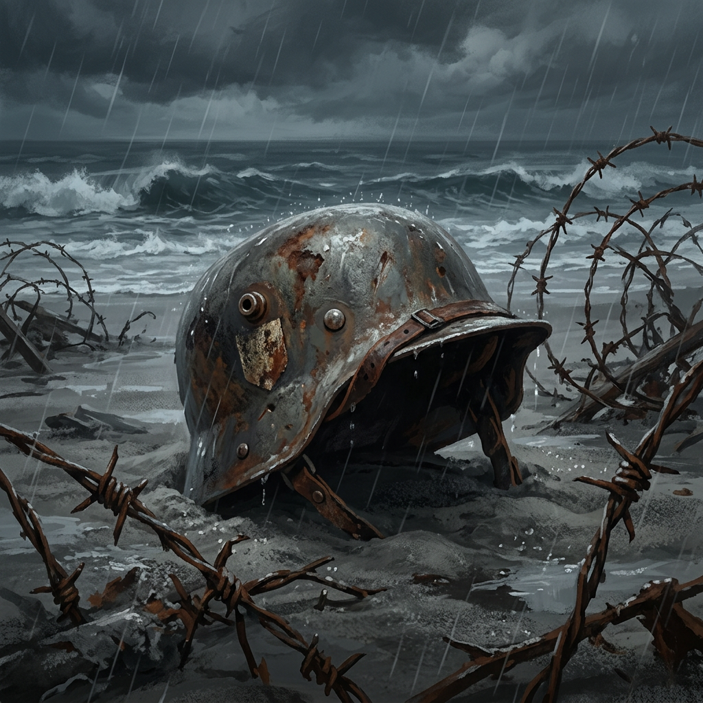

## 사라예보 사건 (Global Index: 31)

- **Korean Concept**: 극적인 조명이 감도는 20세기 초 유럽의 거친 자갈길 위, 차가운 황동 탄피와 핏방울이 얼룩진 화려한 금빛 자수의 찢어진 군복 옷깃을 생생하게 포착한 이미지입니다. 흐릿하게 보이는 빈티지 오픈카 배경이 비극적인 분위기를 더하며, 금속과 찢겨진 천의 질감이 초정밀하게 묘사되었습니다.
- **English Prompt**: 
```text
An empty brass bullet casing rolling on cobblestone streets, a torn piece of an ornate military collar with golden embroidery stained with drops of blood, a blurry vintage open-top car in the background, early 20th century European street setting, dramatic lighting, hyper-detailed, 8k.. stylized historical clue card illustration, premium adult strategy game tone, semi-realistic digital painting, square composition, single clear focal subject, readable at small card size, restrained cinematic lighting, no readable text, no letters, no watermark, no UI elements. Avoid human, people, text, watermark, signature, full body, modern vehicles, extreme macro.
```

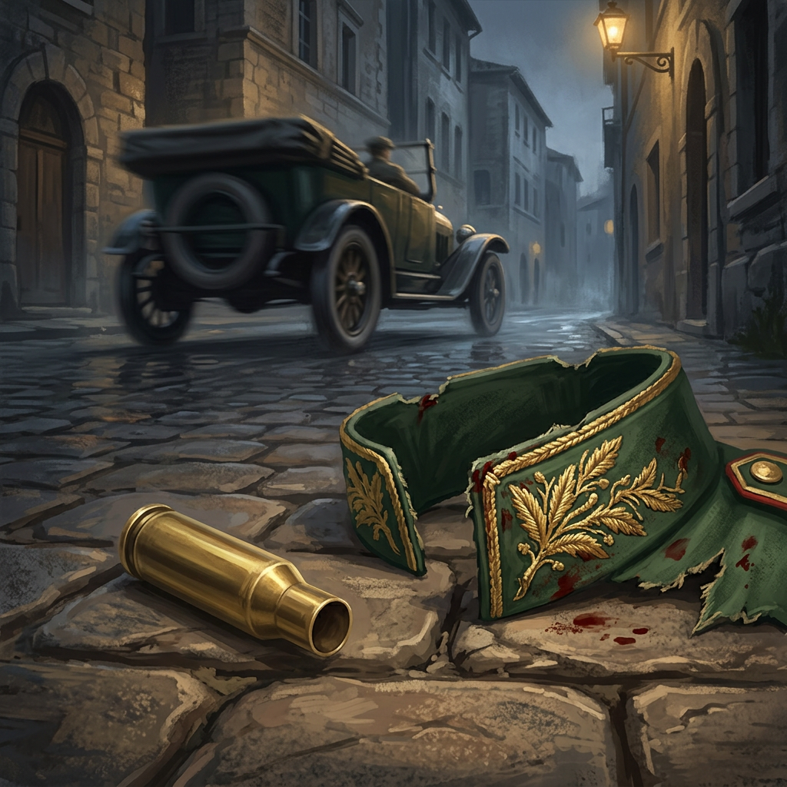

## 체르노빌 원전 사고 (Global Index: 32)

- **Korean Concept**: 어둡고 우울한 새벽, 낙엽이 덮인 갈라진 콘크리트 바닥 위로 심하게 녹슬어 방치된 노란색 범퍼카가 놓여 있습니다. 기괴하게 빛나는 먼지가 공기 중에 내려앉고 저 멀리 폐공장의 실루엣이 드리워져, 황량하고 스산한 분위기를 자아내는 극사실적인 장면입니다.
- **English Prompt**: 
```text
A rusted, abandoned yellow bumper car in a desolate amusement park, cracked concrete ground covered with dead leaves, a faint, eerie glowing dust settling in the air, a distant silhouette of a ruined industrial facility under a dark, gloomy dawn sky, hyper-realistic, atmospheric, 8k.. stylized historical clue card illustration, premium adult strategy game tone, semi-realistic digital painting, square composition, single clear focal subject, readable at small card size, restrained cinematic lighting, no readable text, no letters, no watermark, no UI elements. Avoid human, people, text, watermark, signature, full body, mutant, extreme macro.
```

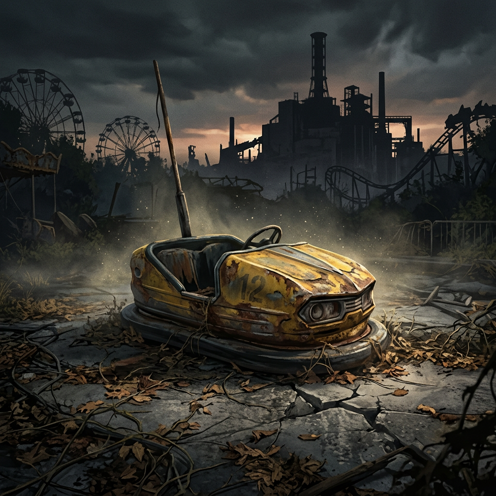

## 살라미스 해전 (Global Index: 33)

- **Korean Concept**: 거친 암석 해안에 밀려온 고대 갤리선의 산산조각 난 나무 널빤지와 자갈 위 검게 그을린 청동 충각의 질감이 생생하게 돋보이는 풍경. 멀리서 타오르는 불길의 주황빛이 어두운 바닷물에 일렁이며, 고대 그리스 좁은 해협의 비장한 시네마틱 무드를 연출합니다.
- **English Prompt**: 
```text
Shattered wooden planks of an ancient galley ship washed up on a rocky shore, a scorched bronze ramming prow piece resting on the pebbles, dark sea water reflecting the orange glow of distant fires, narrow strait landscape, cinematic, ancient Greek era, highly detailed, 8k.. stylized historical clue card illustration, premium adult strategy game tone, semi-realistic digital painting, square composition, single clear focal subject, readable at small card size, restrained cinematic lighting, no readable text, no letters, no watermark, no UI elements. Avoid human, people, text, watermark, signature, full body, extreme macro.
```

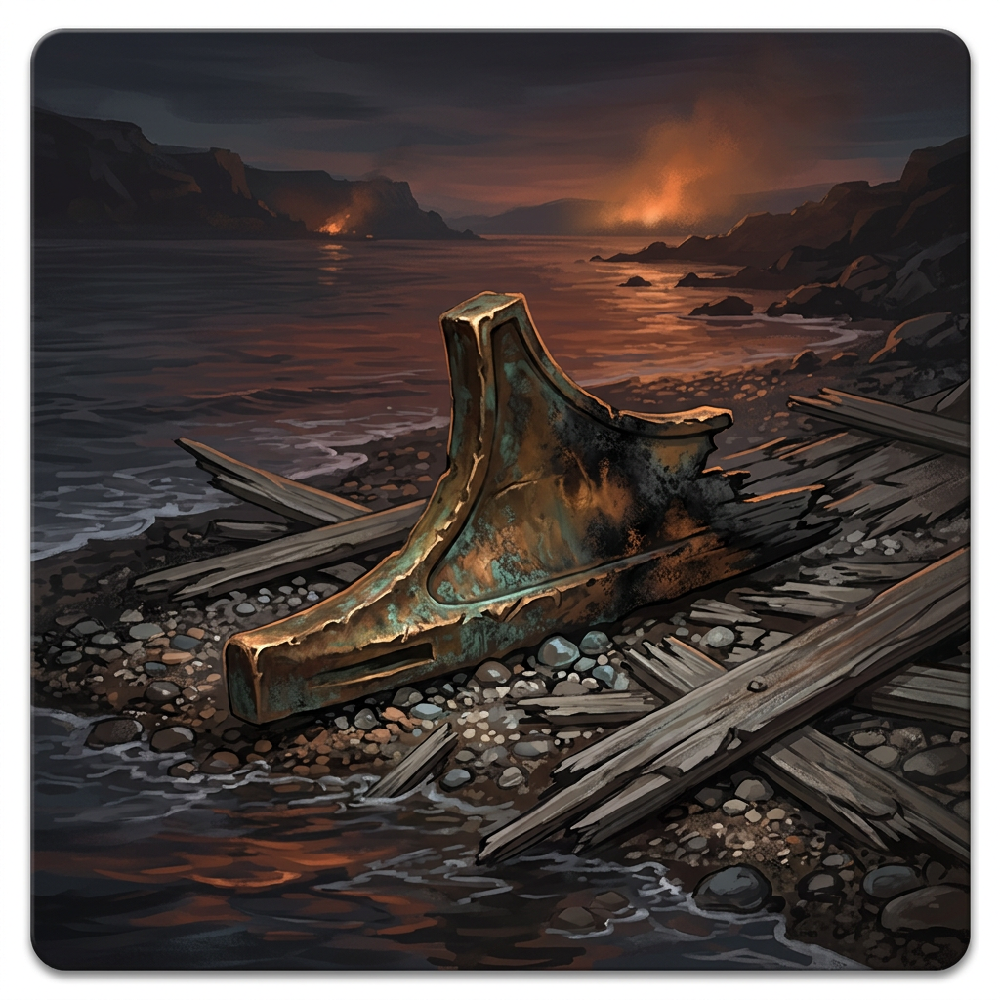

## 유럽 흑사병 창궐 (Global Index: 34)

- **Korean Concept**: 차갑고 축축한 중세 골목길 돌바닥에 버려진, 섬뜩한 가죽 질감의 긴 부리 역병 의사 가면과 거칠고 낡은 나무 지팡이. 바싹 마른 약초들이 흩어진 짙은 안개 속 극적인 명암이 어우러져 지독히 음산한 분위기를 자아내는 실사 이미지.
- **English Prompt**: 
```text
A terrifying leather plague doctor mask with a long beak left on cold, damp cobblestones, a worn wooden walking stick lying next to it, scattered dried herbs and dark mist in a medieval European alleyway, eerie and grim atmosphere, cinematic lighting, 8k resolution, photorealistic.. stylized historical clue card illustration, premium adult strategy game tone, semi-realistic digital painting, square composition, single clear focal subject, readable at small card size, restrained cinematic lighting, no readable text, no letters, no watermark, no UI elements. Avoid human, people, text, watermark, signature, full body, extreme macro.
```

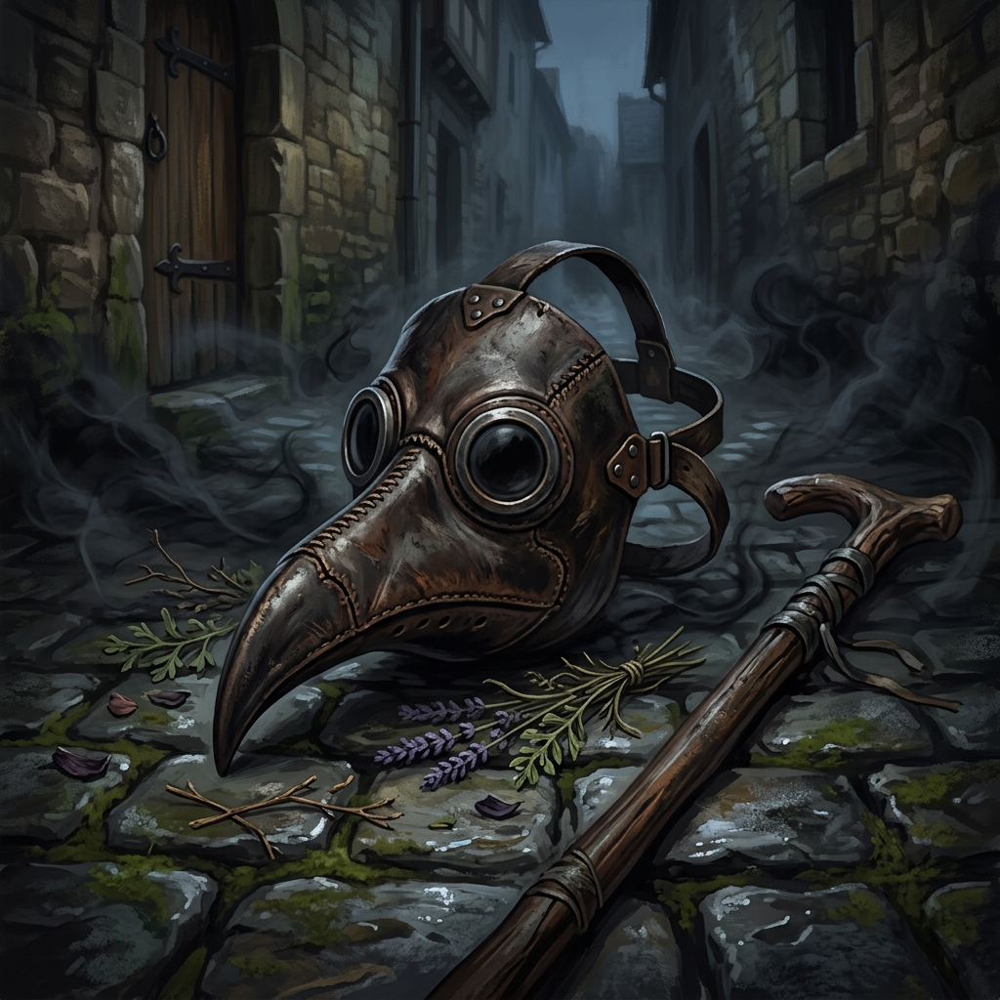

## 콘스탄티노플 함락 (Global Index: 35)

- **Korean Concept**: 산산조각 난 거친 석조 잔해와 찢겨진 초승달 무늬의 붉은 깃발들 사이로, 거대한 고대 석벽을 향해 맹렬히 불을 뿜는 육중한 청동 대포의 극사실적인 풍경입니다. 멀리 황금뿔만(골든혼)이 아스라히 보이며, 영화 같은 극적인 조명과 디테일이 장엄한 전투의 분위기를 극대화하는 고해상도 장면입니다.
- **English Prompt**: 
```text
A massive bronze cannon firing towards ancient massive stone walls, broken masonry, a golden horn bay in the distance, torn red flags with crescents subtly placed among the debris, cinematic lighting, ultra-realistic, highly detailed, 8k resolution.. stylized historical clue card illustration, premium adult strategy game tone, semi-realistic digital painting, square composition, single clear focal subject, readable at small card size, restrained cinematic lighting, no readable text, no letters, no watermark, no UI elements. Avoid human, people, text, watermark, signature, full body.
```

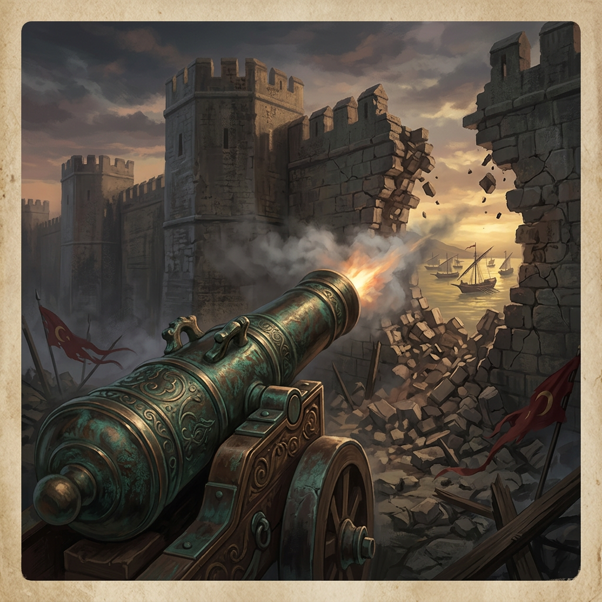

## 라이트 형제 첫 비행 (Global Index: 36)

- **Korean Concept**: 거센 겨울바람에 모래가 흩날리는 해변에 놓인, 거친 나무와 캔버스 천 질감의 20세기 초 초창기 비행 기계입니다. 바닥의 나무 레일과 기체에 정교하게 얽힌 자전거 기어 위로 극적인 아침 햇살이 드리워진 극사실주의 고화질 이미지.
- **English Prompt**: 
```text
An early 20th-century wooden and canvas flying machine resting on a sandy beach, strong winter winds blowing sand, wooden rails on the ground, bicycle gears and chains subtly attached to the machinery, dramatic morning light, hyper-realistic, highly detailed, 8k.. stylized historical clue card illustration, premium adult strategy game tone, semi-realistic digital painting, square composition, single clear focal subject, readable at small card size, restrained cinematic lighting, no readable text, no letters, no watermark, no UI elements. Avoid human, people, text, watermark, signature, full body, modern airplane.
```

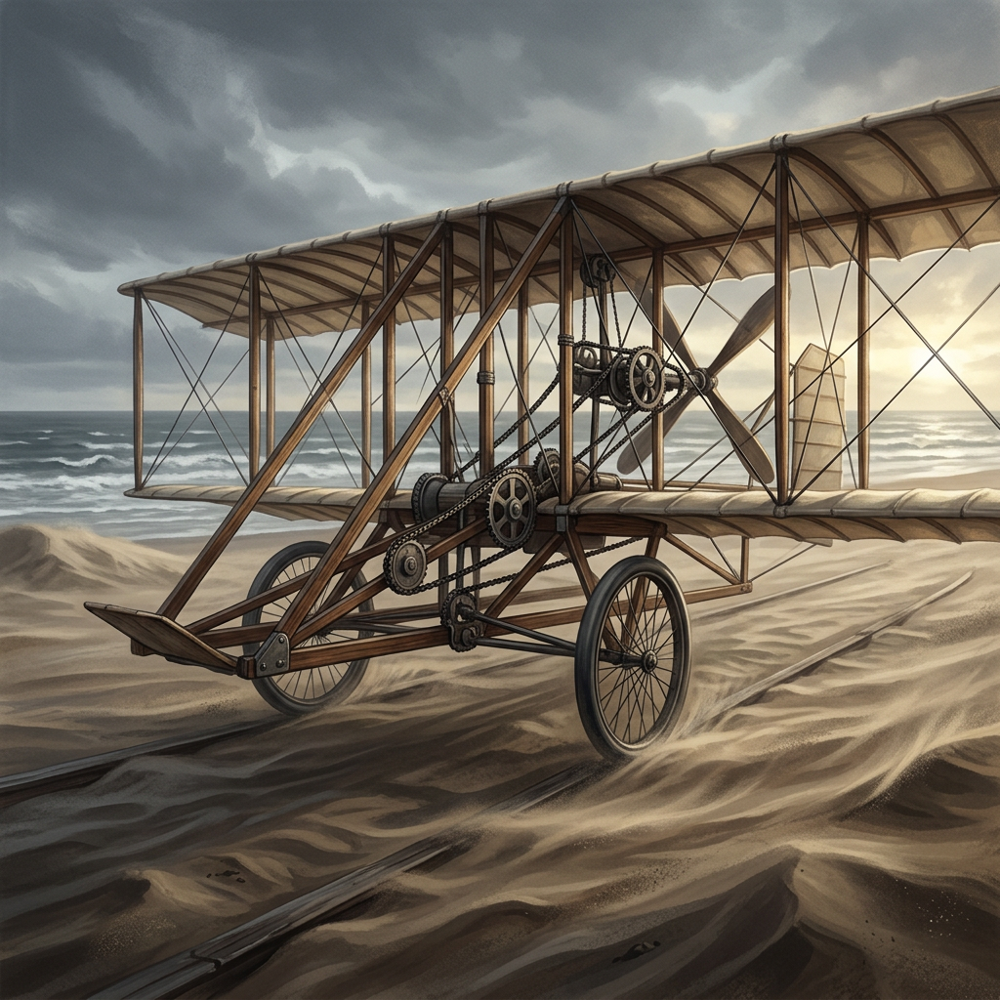

## 바스티유 감옥 습격 (Global Index: 37)

- **Korean Concept**: 육중한 중세 석조 요새의 부서진 철문 앞 거친 조약돌 바닥에 나무 화약통들이 널브러져 있고, 짙은 연기와 화염이 치솟는 생생한 풍경입니다. 불타는 잔해 속에서 찢겨진 청백적 삼색기가 나뒹굴며 극적이고 처절한 전장의 분위기를 자아냅니다.
- **English Prompt**: 
```text
A massive medieval stone fortress with broken iron gates, wooden gunpowder barrels scattered on cobblestone ground, thick smoke and fire, torn tri-color flags in blue, white, and red among the debris, dramatic lighting, highly detailed, 8k.. stylized historical clue card illustration, premium adult strategy game tone, semi-realistic digital painting, square composition, single clear focal subject, readable at small card size, restrained cinematic lighting, no readable text, no letters, no watermark, no UI elements. Avoid human, people, text, watermark, signature, full body, modern buildings.
```

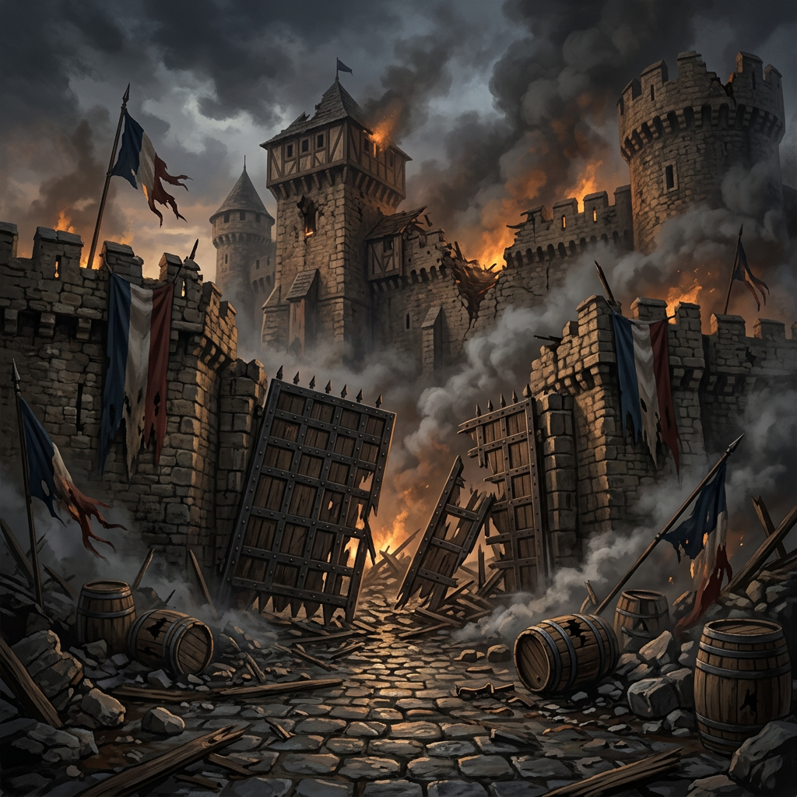

## 콜로세움 (Global Index: 38)

- **Korean Concept**: 극적인 햇빛이 내리쬐는 고대 원형 투기장의 거친 모래바닥에 부서진 청동 투구와 녹슨 검들이 흩어져 있는 초사실적인 와이드 샷. 빛바랜 대리석 기둥과 모래 위에 길게 드리워진 로마 독수리 군기의 그림자가 생생한 질감과 함께 웅장하고도 쓸쓸한 분위기를 자아냅니다.
- **English Prompt**: 
```text
A wide view of an ancient massive circular arena covered in sand, broken bronze gladiator helmets and rusted swords lying on the ground, faded marble pillars, a shadow of a Roman eagle standard cast on the sand, dramatic sunlight, hyper-realistic, highly detailed, 8k.. stylized historical clue card illustration, premium adult strategy game tone, semi-realistic digital painting, square composition, single clear focal subject, readable at small card size, restrained cinematic lighting, no readable text, no letters, no watermark, no UI elements. Avoid human, people, text, watermark, signature, full body, modern elements.
```

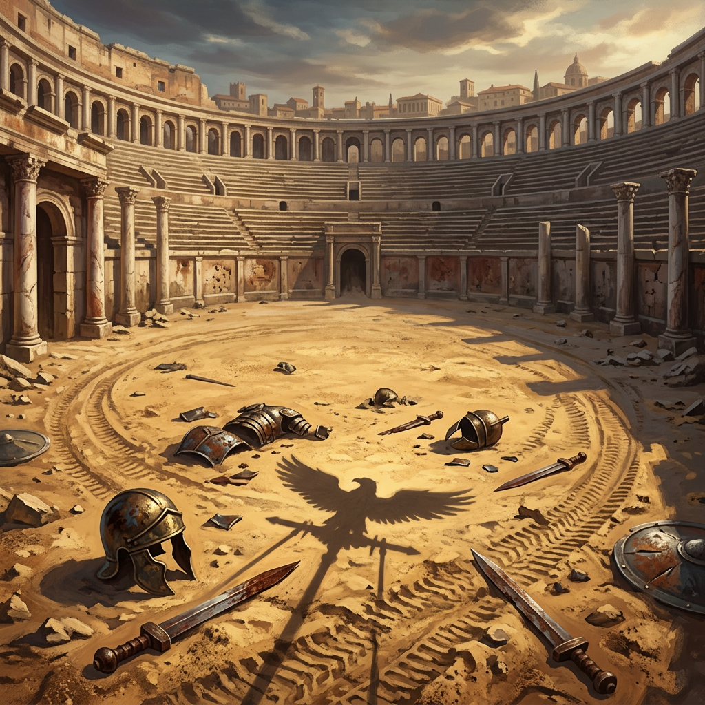

## 마추픽추 (Global Index: 39)

- **Korean Concept**: 거칠지만 정교하게 맞물린 화강암 질감의 고대 유적이 짙은 안개와 구름에 휩싸인 가파른 푸른 산봉우리 위에 우뚝 솟아 있습니다. 전경의 신성한 태양석 제단과 계단식 밭이 어우러져 극적인 신비로움을 자아내는 초고해상도 풍경 사진.
- **English Prompt**: 
```text
Ancient ruined city made of perfectly fitted granite stones, perched high on a steep green mountain peak, surrounded by thick mist and clouds, terraced agricultural fields, a sacred sun stone altar in the foreground, mystical atmosphere, highly detailed, 8k.. stylized historical clue card illustration, premium adult strategy game tone, semi-realistic digital painting, square composition, single clear focal subject, readable at small card size, restrained cinematic lighting, no readable text, no letters, no watermark, no UI elements. Avoid human, people, text, watermark, signature, full body, modern roads.
```

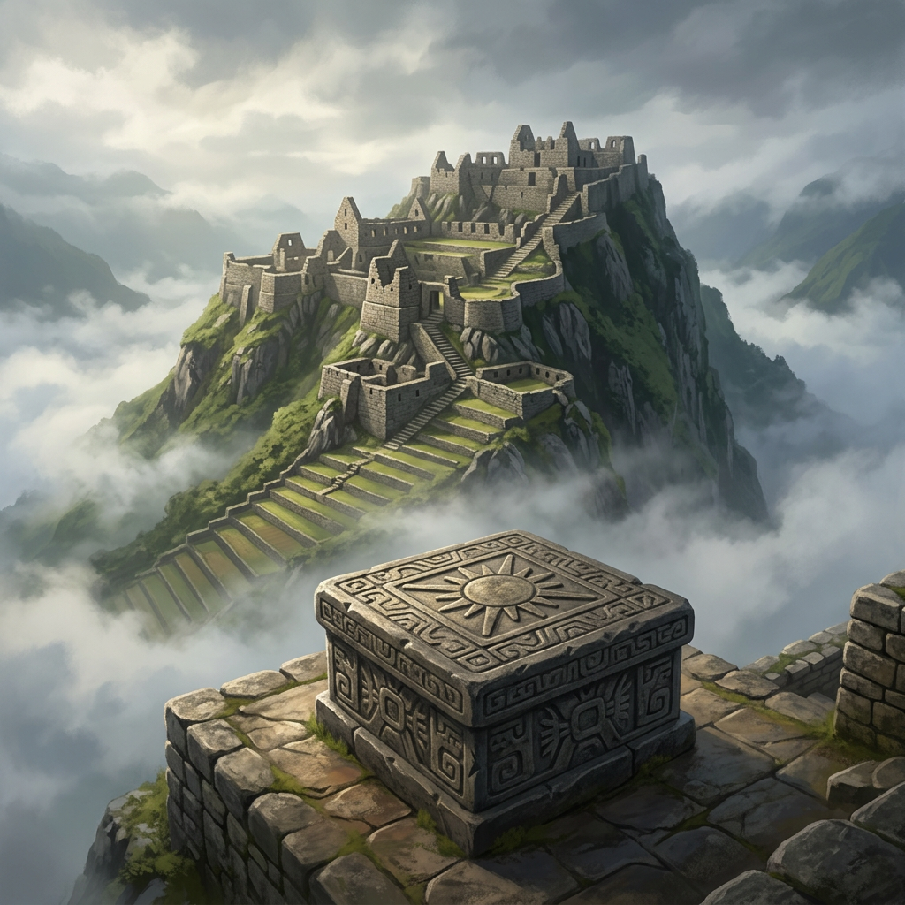

## 타지마할 (Global Index: 40)

- **Korean Concept**: 따스한 황금빛 햇살을 머금은 순백의 대리석 돔이 잔잔한 강물에 거울처럼 반사된 완벽한 대칭 구조의 무굴 양식 건축물 사진. 맑고 푸른 하늘을 배경으로 벽면에 새겨진 정교한 꽃무늬 상감 장식의 섬세한 질감이 생생하게 돋보입니다.
- **English Prompt**: 
```text
High quality, ultra-detailed, a large pristine white marble dome reflecting on a still river, intricate floral inlay work on the walls, golden sunlight casting a warm glow, symmetrical Mughal architectural style, set against a clear blue sky.. stylized historical clue card illustration, premium adult strategy game tone, semi-realistic digital painting, square composition, single clear focal subject, readable at small card size, restrained cinematic lighting, no readable text, no letters, no watermark, no UI elements. Avoid human, people, text, watermark, signature, full body.
```

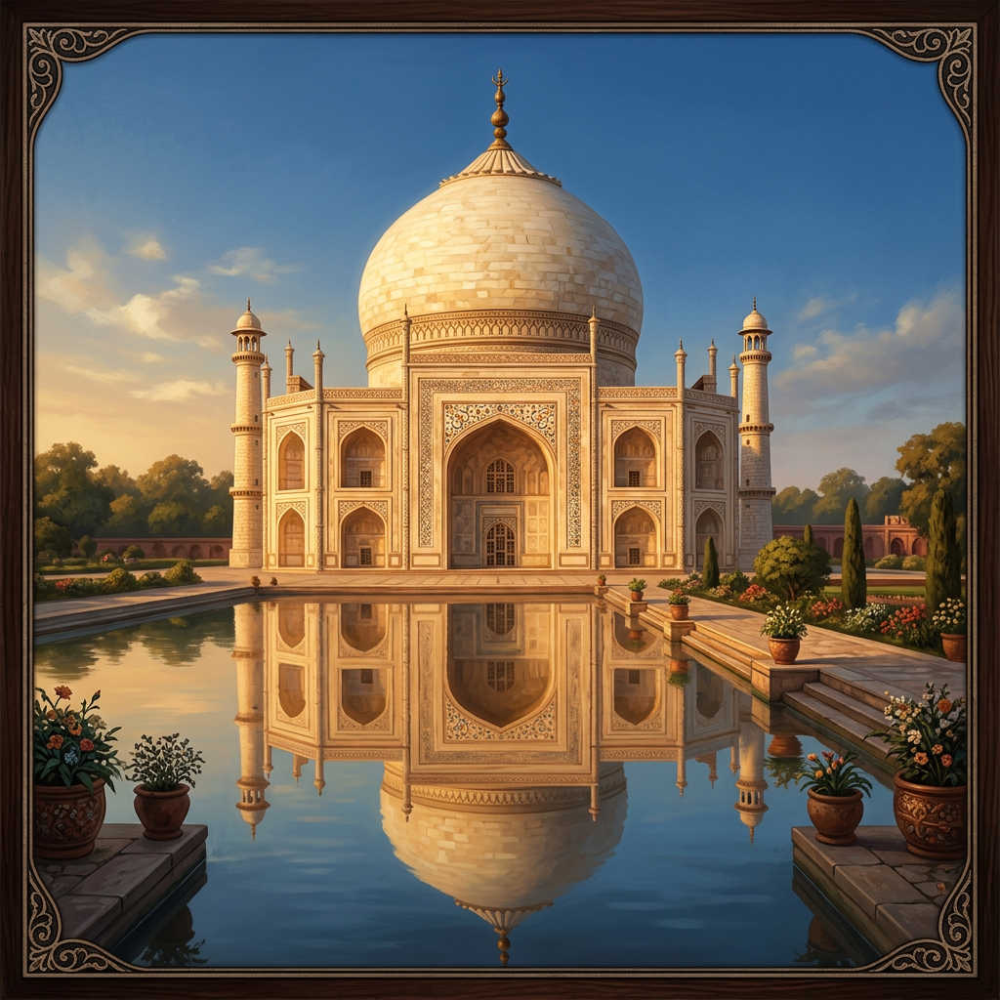

## 베르사유 궁전 (Global Index: 41)

- **Korean Concept**: 거대한 크리스탈 샹들리에와 반짝이는 금빛 조각상들로 치장된 바로크 양식의 호화로운 복도 풍경. 프레스코화 천장 아래로 늘어선 높은 거울과 아치형 창문이 어우러져 극도로 정교하고 웅장한 분위기를 자아냅니다.
- **English Prompt**: 
```text
High quality, ultra-detailed, an opulent long hallway lined with tall mirrors on one side and large arched windows on the other, massive crystal chandeliers hanging from a painted fresco ceiling, gilded gold ornaments and statues, baroque architectural style.. stylized historical clue card illustration, premium adult strategy game tone, semi-realistic digital painting, square composition, single clear focal subject, readable at small card size, restrained cinematic lighting, no readable text, no letters, no watermark, no UI elements. Avoid human, people, text, watermark, signature, full body.
```

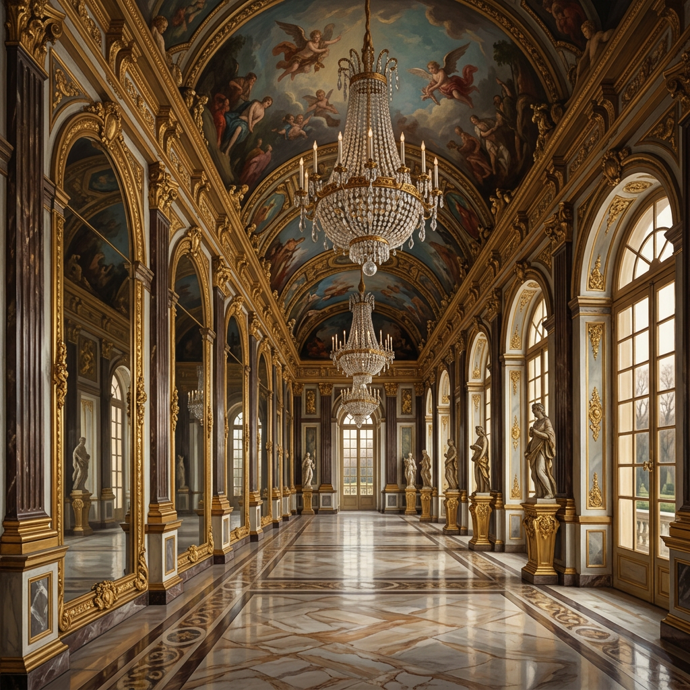

## 알렉산드리아 도서관 (Global Index: 43)

- **Korean Concept**: 수많은 파피루스 두루마리가 빼곡한 나무 선반과 정교한 헬레니즘 양식의 돌기둥이 늘어선 웅장한 고대의 전당. 허공에 흩날리는 재와 붉은 불씨가 따뜻하면서도 비극적인 조명과 어우러진 초정밀 사진.
- **English Prompt**: 
```text
High quality, ultra-detailed, vast ancient interior hall filled with wooden shelves holding countless papyrus scrolls, intricate Hellenistic stone columns, scattered embers and floating ash in the air, warm and tragic lighting.. stylized historical clue card illustration, premium adult strategy game tone, semi-realistic digital painting, square composition, single clear focal subject, readable at small card size, restrained cinematic lighting, no readable text, no letters, no watermark, no UI elements. Avoid human, people, text, watermark, signature, full body.
```

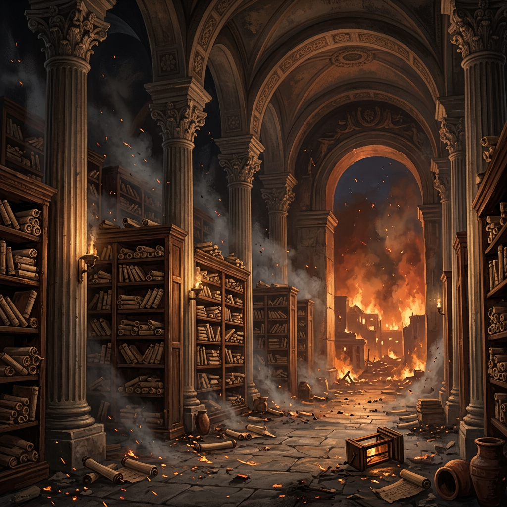

## 만리장성 (Global Index: 44)

- **Korean Concept**: 세월의 풍화가 깃든 거친 돌과 벽돌 요새가 가을 단풍이 물든 험준한 능선을 따라 굽이치는 웅장한 풍경입니다. 안개 낀 아득한 산봉우리와 낡은 망루가 어우러져 압도적이고 장엄한 분위기를 자아냅니다.
- **English Prompt**: 
```text
High quality, ultra-detailed, a massive ancient stone and brick fortification winding along the steep ridges of rugged mountains, weathered watchtowers, autumn foliage, misty distant peaks, grand and majestic atmosphere.. stylized historical clue card illustration, premium adult strategy game tone, semi-realistic digital painting, square composition, single clear focal subject, readable at small card size, restrained cinematic lighting, no readable text, no letters, no watermark, no UI elements. Avoid human, people, text, watermark, signature, full body.
```

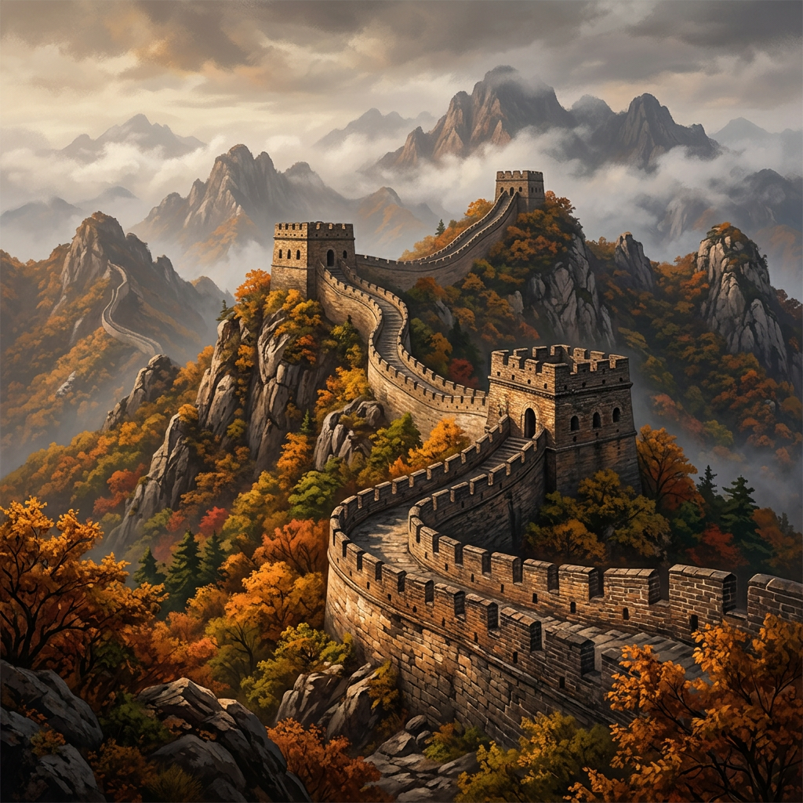

## 스톤헨지 (Global Index: 45)

- **Korean Concept**: 폭풍우가 몰아치는 극적인 하늘 아래, 초원 위로 우뚝 솟은 투박하고 거대한 직사각형 거석. 밑동 주변 흙바닥에 낡은 사슴뿔 곡괭이 파편들이 흩어져 있어, 돌의 거친 질감과 묵직한 고대의 분위기를 생생하게 자아내는 극사실적인 시네마틱 이미지.
- **English Prompt**: 
```text
A massive, rough-hewn rectangular megalith standing upright on a grassy plain under a stormy, dramatic sky, with fragments of ancient antler picks scattered in the dirt near its base, hyper-realistic, cinematic lighting, ancient atmosphere.. stylized historical clue card illustration, premium adult strategy game tone, semi-realistic digital painting, square composition, single clear focal subject, readable at small card size, restrained cinematic lighting, no readable text, no letters, no watermark, no UI elements. Avoid human, people, text, watermark, signature, full body, modern buildings.
```

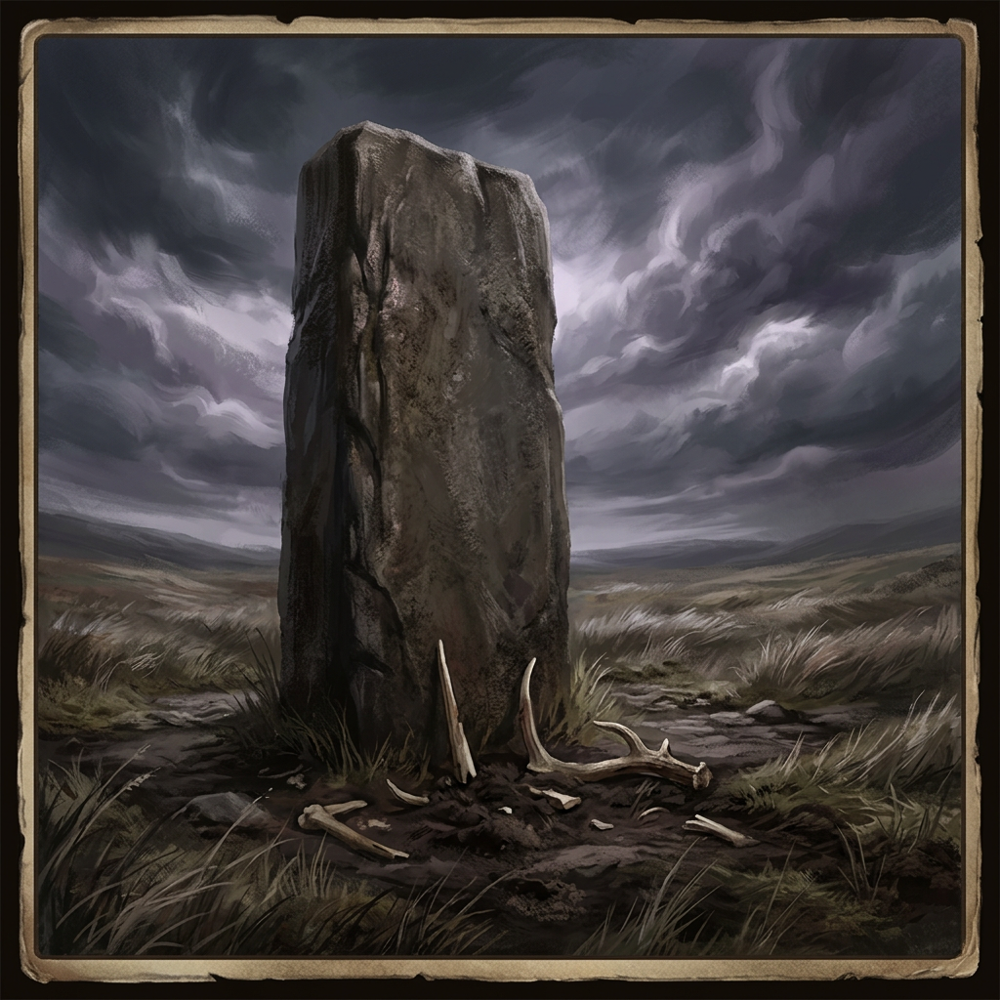

## 페트라 (Global Index: 46)

- **Korean Concept**: 좁고 어두운 협곡 틈새로 극적인 빛줄기가 쏟아지며, 장미빛 사암 절벽에 정교하게 조각된 고대 건축물을 비춥니다. 앞쪽 모래 바닥에 흩어진 마른 유향 조각들의 거친 질감까지 생생하게 묘사된 웅장하고 극사실적인 풍경입니다.
- **English Prompt**: 
```text
Elaborate ancient architectural façade carved directly into a towering rose-red sandstone cliff, viewed from a narrow, shadowy canyon, with small pieces of dried frankincense resin resting on the sandy ground in the foreground, highly detailed, dramatic sun shafts, photorealistic.. stylized historical clue card illustration, premium adult strategy game tone, semi-realistic digital painting, square composition, single clear focal subject, readable at small card size, restrained cinematic lighting, no readable text, no letters, no watermark, no UI elements. Avoid human, people, text, watermark, signature, full body, modern objects.
```

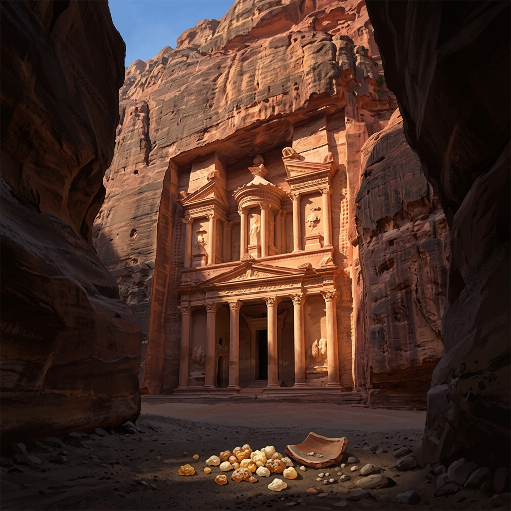

## 기자의 대피라미드 (Global Index: 47)

- **Korean Concept**: 작열하는 사막 태양 아래 계단식으로 쌓인 거대한 하얀 석회암 표면 위로, 빛바랜 파피루스 두루마리와 낡은 구리 끌이 놓여 있는 클로즈업 사진. 영화 같은 조명과 극사실적인 질감 묘사가 고대 이집트의 웅장하고 신비로운 분위기를 자아냅니다.
- **English Prompt**: 
```text
A close view of massive, precisely cut white limestone blocks stacked in a stepped formation under a blazing desert sun, with an ancient faded papyrus scroll and worn copper chisels resting on the stone surface, hyper-detailed, cinematic lighting, ancient Egyptian aesthetic.. stylized historical clue card illustration, premium adult strategy game tone, semi-realistic digital painting, square composition, single clear focal subject, readable at small card size, restrained cinematic lighting, no readable text, no letters, no watermark, no UI elements. Avoid human, people, text, watermark, signature, full body, modern tools.
```

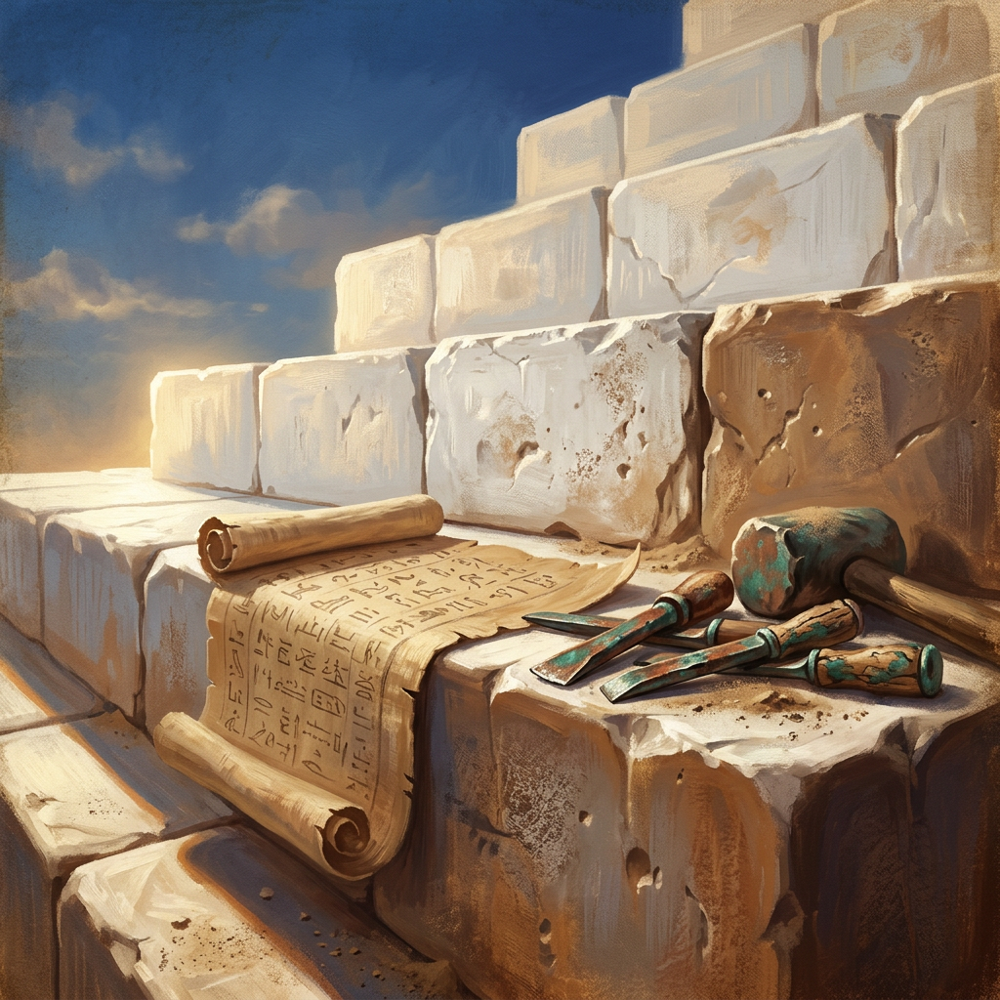

## 판테온 (Global Index: 48)

- **Korean Concept**: 오래된 대리석 바닥 위에 놓인 매끄럽고 거대한 화강암 기둥 밑동과 그 곁에 떨어진 월계관 문양의 녹슨 청동 동전. 보이지 않는 천장 위에서 수직으로 내리꽂히는 강렬한 한 줄기 빛이 각 소재의 질감과 고풍스러운 분위기를 극적으로 살려낸 초현실적인 건축 사진.
- **English Prompt**: 
```text
A massive, smooth granite column base resting on an ancient marble floor, with a single rusty bronze coin featuring a laurel-wreathed profile lying nearby, illuminated by a single powerful vertical shaft of light descending from an unseen opening above, ultra-realistic, architectural photography.. stylized historical clue card illustration, premium adult strategy game tone, semi-realistic digital painting, square composition, single clear focal subject, readable at small card size, restrained cinematic lighting, no readable text, no letters, no watermark, no UI elements. Avoid human, people, text, watermark, signature, full body, modern architecture.
```

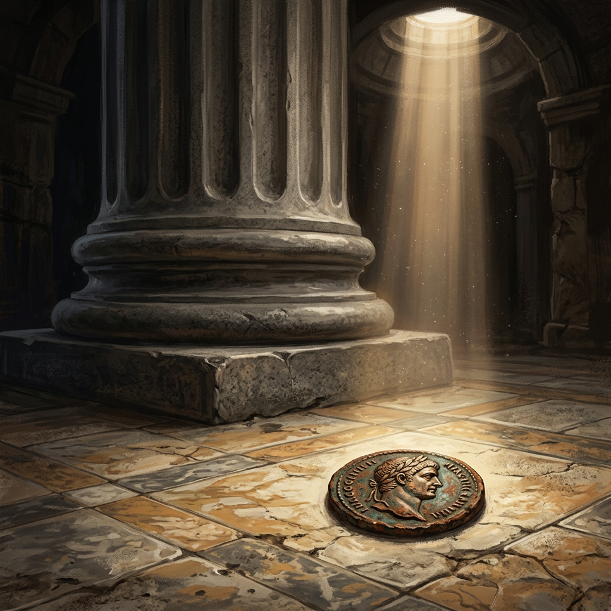

## 알함브라 궁전 (Global Index: 49)

- **Korean Concept**: 정교한 아라베스크 무늬가 새겨진 상아색 벽 타일을 배경으로, 고요한 연못 가장자리에 붉은 과즙이 뚝뚝 흐르는 반쯤 갈라진 석류가 놓인 극사실적인 사진입니다. 따뜻한 늦은 오후의 햇살이 드리워져 타일의 섬세한 질감과 생생한 색채가 돋보입니다.
- **English Prompt**: 
```text
Intricate Islamic geometric arabesque carvings on an ivory-colored wall tile, with a half-opened pomegranate dripping red juice placed delicately on the edge of a serene reflecting pool, warm late afternoon sunlight, highly detailed, photorealistic.. stylized historical clue card illustration, premium adult strategy game tone, semi-realistic digital painting, square composition, single clear focal subject, readable at small card size, restrained cinematic lighting, no readable text, no letters, no watermark, no UI elements. Avoid human, people, text, watermark, signature, full body.
```

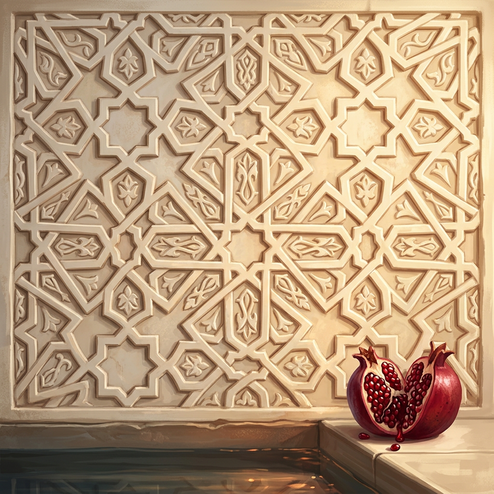

